# TD FPGA

## Séance 1 : Tuto modelsim, bases, arithmétique

### Tutoriel Modelsim

#### Installer le simulateur

En TD et en TP, vous utiliserez le logiciel Modelsim pour simuler vos composants VHDL.

> Modelsim n'est pas disponible sur Mac. Vous pouvez vous rabattre sur l'outil libre et opensource ```ghdl```. 
> Un tuto sera fourni un jour, en attendant débrouillez-vous.

La dernière version disponible sans licence est ```20.1.1``` disponible à cette adresse : 

[Modelsim version 20.1.1](https://www.intel.com/content/www/us/en/software-kit/750666/modelsim-intel-fpgas-standard-edition-software-version-20-1-1.html)

L’éditeur de Modelsim (ainsi que celui de Quartus Prime, que nous utiliserons en TP) est nul. 
Vous pouvez installer autre chose, comme VSCode. Dans ce cas, installez aussi une extension pour le vhdl.

#### Création d'un premier composant

1. Créez un nouveau dossier ```1-tuto_modelsim```

> Pas d’espaces, pas d’accents, sur un disque dur (pas dans un Drive, pas sur une clé USB/disque dur externe)

2. Lancer un éditeur comme VSCode
3. Créez un fichier ```composant_nul.vhd```
4. Copiez le code suivant (Pensez à votre prof : respectez l’indentation!)

```vhdl
library ieee;
use ieee.std_logic_1164.all;

entity composant_nul is
    port (
        sw : in std_logic;
        led : out std_logic
    );
end entity composant_nul;

architecture rtl of composant_nul is
begin
    led <= sw;
end architecture rtl;
```

5. Décrivez en une phrase ce que fait le composant ci-dessus.

#### Écriture du test-bench

1. Créez un fichier ```composant_nul_tb.vhd```
2. Copiez-y le code suivant :

```vhdl
library ieee;
use ieee.std_logic_1164.all;

entity composant_nul_tb is
    -- Entity of a test bench is always empty
end entity composant_nul_tb;

architecture tb of composant_nul_tb is
    signal tb_led : std_logic;
    signal tb_sw : std_logic;
begin
    uut: entity work.composant_nul
    port map
    (
        led => tb_led,
        sw => tb_sw
    );

    process
    begin
        tb_sw <= '0';
        wait for 10 ns;
        tb_sw <= '1';
        wait for 10 ns;
        tb_sw <= '0';
        wait for 10 ns;
        tb_sw <= '1';
        wait for 10 ns;
        wait;
    end process;
end architecture tb;
```

3. Expliquez le code
4. Pourquoi le ```process``` finit-il par le mot-clé ```wait``` ?

#### Fichier de simulation

1. Créez un fichier ```composant_nul.do```
2. Copiez-y le code suivant : 
```tcl
quit -sim

vlib work

vcom composant_nul.vhd
vcom composant_nul_tb.vhd

vsim -c work.composant_nul_tb

# INPUTS
add wave -divider Inputs:
add wave -color yellow uut/sw

# OUTPUTS
add wave -divider Outputs:
add wave uut/led

run -all
```

#### Simulation avec Modelsim

1. Lancez Modelsim. L'interface est assez austère, c'est comme ça, il faudra s'y faire.
2. Dans l'invite de commande, vous pouvez taper ```pwd``` pour savoir dans quel dossier vous vous situez.

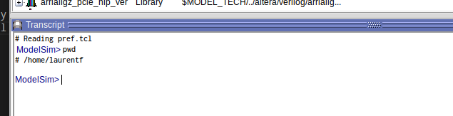

3. Puis tapez ```cd <chemin/vers/le/dossier>```

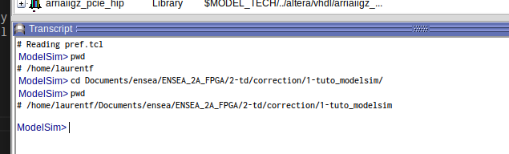

4. Puis enfin, tapez ```do composant_nul.do```. Modelsim devrait maintenant ressembler à ça :

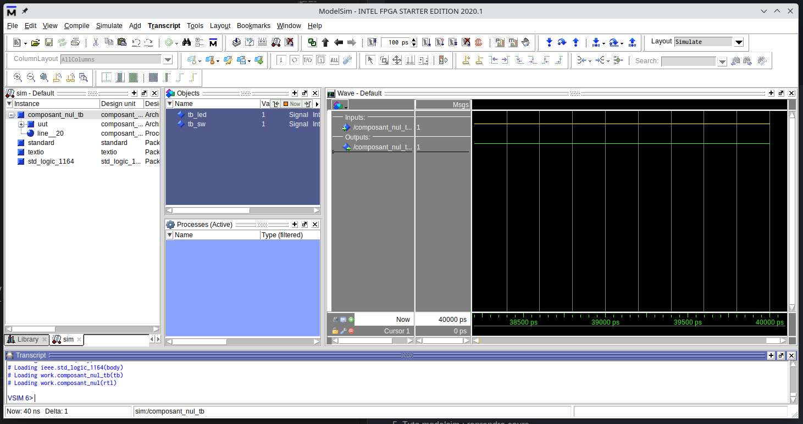

5. Vous pouvez dézoomer pour voir l'intégralité de vos signaux en cliquant sur la loupe bleue :

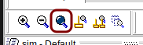

### Encodeur/Décodeur

Pour concevoir des circuits numériques, vous aurez souvent besoin de convertir des signaux d'une représentation à une autre.
Les circuits responsables de ces conversions sont appelés _encodeurs_ ou _décodeurs_, ou plus simplements _codeurs_.

#### Décodeur 2 vers 4

Dans cet exercice, vous allez écrire le code VHDL d'un décodeur 2 vers 4. Voici sa table de vérité :

| in1 | in0 | out3 | out2 | out1 | out0 | 
|:---:|:---:|:----:|:----:|:----:|:----:|
| 0   |   0 |    0 |    0 |    0 |    1 |
| 0   |   1 |    0 |    0 |    1 |    0 |
| 1   |   0 |    0 |    1 |    0 |    0 |
| 1   |   1 |    1 |    0 |    0 |    0 |

En VHDL, il existe beaucoup de manières différentes de décrire un décodeur : 
* ```with ... select```,
* ```when ... else```,
* ```case ... when``` au sein d'un ```process```,
* ```if ... then ... elsif``` au sein d'un ```process```.

1. Créez un fichier decoder.vhd
2. Choisissez une de ces quatre méthodes et écrivez le code d'un décodeur 2 vers 4
3. Simulez-le à l'aide du _test bench_ suivant

```vhdl
library ieee;
use ieee.std_logic_1164.all;

entity decoder_tb is
end entity decoder_tb;

architecture tb of decoder_tb is
    signal tb_data_in : std_logic_vector(1 downto 0);
    signal tb_data_out : std_logic_vector(3 downto 0);
begin
    uut : entity work.decoder
        port map (
            data_in => tb_data_in,
            data_out => tb_data_out
        );

    process
    begin
        tb_data_in <= "00";
        wait for 10 ns;
        tb_data_in <= "01";
        wait for 10 ns;
        tb_data_in <= "10";
        wait for 10 ns;
        tb_data_in <= "11";
        wait for 10 ns;
        tb_data_in <= "UU"; -- Undefined inputs, should lead to undefined outputs
        wait for 10 ns;
        wait;
    end process;
end architecture tb;
```

### Multiplexeur

Le multiplexeur est un autre circuit de base **très** utilisé. Les multiplexeurs servent notamment à réaliser des structures conditionnelles (```if then else```).

1. Écrivez le code VHDL d'un multiplexeur 2 vers 1 dont la taille de bus sera configurable

> Vous aurez à utiliser le mot-clé ```generic```

2. Testez avec un _test bench_

> En plus du ```port map```, il faudra un ```generic map``` pour configurer le composant

### ALU

L'ALU (Arithmetic and Logic Unit) est un composant que l'on retrouve dans la quasi totalité des microprocesseurs.
C'est un composant qui permet de réaliser une opération au choix sur deux opérandes.

Dans cet exercice, votre ALU permettra d'effectuer 8 opérations :
* Addition
* Soustraction
* Multiplication
* Division
* OU logique
* ET logique
* OU-EXCLUSIF
* NON logique (sur une seule opérande)

1. Combien de bits de sélection sont nécessaires ?
2. Proposez un schéma (sur papier!)
3. Écrivez le code VHDL de l'ALU

> Vous utiliserez des signaux de type ```signed```

> Vous aurez besoin de la librairie ```numeric_std```

4. Testez à l'aide d'un _test bench_

## Séance 2 : Circuits séquentiels

### La bascule D

1. Décrire en quelques mots le fonctionnement d'une bascule D.
2. Créez un nouveau fichier ```dff.vhd```.
3. Dans ce fichier, écrivez le code VHDL d'une bascule D simple.
4. Écrivez son _test bench_ et simulez là.
5. Ajoutez un signal de reset. Simulez.
6. Ajoutez un signal d'enable. Simulez.

### Registres (séries/parallèles)

1. Tracez le schéma d'un registre série vers série de 4 bits.
2. Complétez le chronogramme suivant :
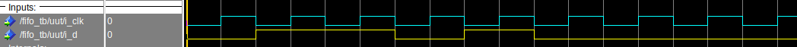
3. Créez un fichier ```fifo.vhd```.
4. Quels seront les signaux a mettre dans la _liste de sensiblité_ ?
5. Écrivez le code d'un registre série vers série dont la profondeur est configurables à l'aide de ```generic```.

> À partir de cette question je ne le demanderais plus, mais tout circuit séquentiel doit avoir un signal de reset.

> Vous ajouterez également un signal d'enable.

6. Écrivez son _test bench_ et simulez le.

### Compteurs

1. Tracez le schéma de principe d'un compteur générique.
2. Tracez le chronogramme d'un compteur 2 bits.
3. Créez un fichier ```counter.vhd```.
4. Écrivez le code d'un compteur générique.

> On oublie pas pas le reset et l'enable

5. Écrivez son _test bench_ et simulez le.

### FSM

Voici le code d'un séquenceur :

```vhdl
library ieee;
use ieee.std_logic_1164.all;

entity fsm is
    port (
        i_clk : in std_logic;
        i_rst_n : in std_logic;

        i_p50 : in std_logic;
        i_p100 : in std_logic;

        o_coffee : out std_logic;
        o_money : out std_logic
    );
end entity fsm;

architecture rtl of fsm is
    type state_t is (ZERO, FIFTY, HUNDRED, ONE_FIFTY, TWO_HUNDREDS);
    signal r_state : state_t := ZERO;
    signal s_next_state : state_t;
begin
    process(i_clk, i_rst_n)
    begin
        if (i_rst_n = '0') then
            r_state <= ZERO;
        elsif (rising_edge(i_clk)) then
            r_state <= s_next_state;
        end if;
    end process;

    process(r_state, i_p50, i_p100)
    begin
        case r_state is
            when ZERO => 
                if (i_p50 = '1') then
                    s_next_state <= FIFTY;
                elsif (i_p100 = '1') then
                    s_next_state <= HUNDRED;
                else
                    s_next_state <= ZERO;
                end if;
            when FIFTY => 
                if (i_p50 = '1') then
                    s_next_state <= HUNDRED;
                elsif (i_p100 = '1') then
                    s_next_state <= ONE_FIFTY;
                else
                    s_next_state <= FIFTY;
                end if;
            when HUNDRED => 
                if (i_p50 = '1') then
                    s_next_state <= ONE_FIFTY;
                elsif (i_p100 = '1') then
                    s_next_state <= TWO_HUNDREDS;
                else
                    s_next_state <= HUNDRED;
                end if;
            when ONE_FIFTY => 
                s_next_state <= ZERO;
            when TWO_HUNDREDS => 
                s_next_state <= ZERO;
            when others => 
                s_next_state <= ZERO;
        end case;
    end process;

    o_coffee <= '1' when (r_state = ONE_FIFTY) or (r_state = TWO_HUNDREDS) else '0';
    o_money <= '1' when (r_state = TWO_HUNDREDS) else '0';
end architecture rtl;
```

1. Pourquoi ```r_state``` est initialisé et pas ```s_next_state``` ?
2. Justifiez les signaux présents dans la liste de sensiblité des différents ```process```.
3. Tracer le schéma d'architecture du composant.
4. Identifiez les parties du code en lien avec le schéma tracé.
5. Tracer le graphe d'état du séquenceur.
6. Complétez le graphe d'états suivant.

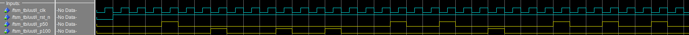

## Séance 3 : Contrôleur HDMI

Le contrôleur HDMI a deux rôles :
* Générer les signaux de contrôle pour le composant ```ADV7513``` présent sur la DE10-Nano,
* Fournir une adresse au circuit responsable de générer les pixels.

### Entity

Le contrôleur HDMI doit être configurable pour s'adapter à différentes résolutions.
Il doit donc disposer d'un certain nombre de paramètres ```generic``` :
* La résolution ```h_res``` et ```v_res```,
* Les timings spécifiques requis par le ```ADV7513```.

Voici leur valeurs pour une résolution de 480p (720x480) :

| param  | value |
|:------:|:-----:|
| h_res  | 720   |
| v_res  | 480   |
| h_sync | 61    |
| h_fp   | 58    |
| h_bp   | 18    |
| v_sync | 5     |
| v_fp   | 30    |
| v_bp   | 9     |

1. Créez un fichier ```hdmi_controler.vhd```
2. Écrivez la partie ```generic``` de son ```entity```

> Les paramètres peuvent être de type ```positive```

Concernant les signaux d'entrée/sorties, ils sont de trois types :
* Horloge et reset :
    * i_clk
    * i_rst_n
* Signaux de contrôle du composant ```ADV7513``` :
    * o_hdmi_hs
    * o_hdmi_vs
    * o_hdmi_de
* Signaux à destination du circuit générant les pixels :
	* o_pixel_en
	* o_pixel_address
	* o_x_counter
	* o_y_counter

> Les signaux d'adresse et de compteurs horizontaux et verticaux peuvent être de type ```natural```

3. Écrivez la partie ```port``` de l'```entity```

### Synchro horizontale

1. Créez trois constantes :
    * h_start : h_sync + h_fp
    * h_end : h_start + h_res
    * h_total : h_end + h_bp
2. Que représentent chacune de ces constantes ?
3. Créez deux registres internes :
    * r_h_count : pour compter la _totalité_ des pixels (actifs et non-actifs)
    * r_h_active : indique si les pixels sont actifs ou non.
4. Créez un process sensible aux signaux d'horloge et de reset.
5. Lors d'un reset, initialisez le signaux suivants :
    * r_h_count à 0,
    * o_hdmi_hs à '1',
    * r_h_active à '0',

Le reste du process sera consacré à l'écriture de trois registres : 
* r_h_count,
* o_hdmi_hs,
* r_h_active,

6. Écrivez le code du compteur ```r_h_count```. Il devra compter de 0 à ```h_total```.

> Le code doit se situer dans le process, lors d'un front montant d'horloge

7. Écrivez le code du registre ```o_hdmi_hs```. Il doit valoir '1' si ```r_h_count >= h_sync``` et que ```r_h_count /= h_total```.

> Ce registre est décrit dans le même process et dans la même condition d'horloge que le registre précédent

8. Écrivez le code du registre ```r_h_active```. Il passe à '1' lorsque ```r_h_count = h_start``` et passe à '0' lorsque ```h_count = h_end```.

> Ce registre est décrit au même endroit que les deux précédents.

9. Écrivez un testbench et simulez dans Modelsim.

Le signaux ```o_hdmi_hs``` et ```r_h_active``` devraient ressembler à ça :

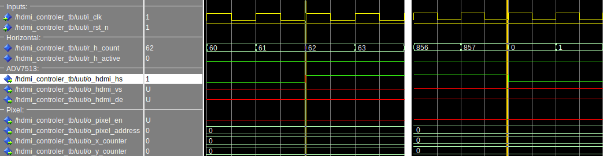
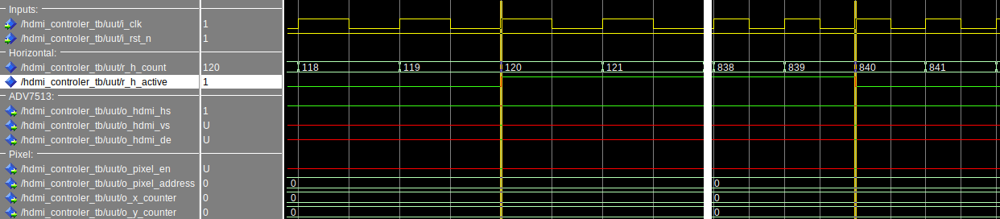

### Synchro verticale

La structure responsable de la synchronisation verticale est très proche de la synchronisation horizontale. La principale différence réside dans le fait que le compteur n'est autorisé à changer de valeur que lorsque le compteur horizontal termine sa ligne (```h_count = h_total```).

1. En vous inspirant de la synchro horizontale, créez trois constantes :
	* ```v_start```
	* ```v_end```
	* ```v_total```
2. Créez deux registres internes :
    * ```r_v_count```
    * ```r_v_active```
3. Créez un process sensible aux signaux d'horloge et de reset.
4. Écrivez les initialisation du reset.
5. Écrivez le code du compteur de 0 à ```v_total```.
6. Écrivez le code du signal de sortie ```o_hdmi_vs```.
7. Écrivez le code du registre ```r_h_active```.
8. Faites évoluer votre testbench et simulez dans Modelsim.

Le signaux ```r_v_count```, ```o_hdmi_vs``` et ```r_v_active``` devraient ressembler à ça :

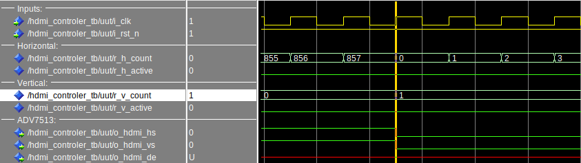
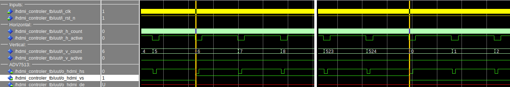
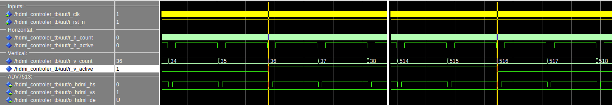

### Data Enable : Pixels actifs

Cette partie est plus simple, vous allez décrire le registre de sortie ```o_hdmi_de```.

1. Créez un nouveau process sensible sur l'horloge et le reset.
2. En cas de reset, la sortie ```o_hdmi_de``` prend la valeur '0'.
3. En cas de front montant : ```o_hdmi_de <= r_v_active and r_h_active;```

### Générateur d'adresse et de coordonnées

1. Écrivez le code permettant de générer le signal ```o_pixel_en```

> Il doit valoir '1' r_v_active et r_h_active sont à '1'

2. Écrivez le code permettant de générer les signaux ```o_x_counter```, ```o_y_counter```.

> Ces signaux représentent les pixels **actifs**. (0,0) est le premier pixel en haut à gauche.

3. Écrivez le code du signal ```o_pixel_address```

> Ce signal évolue de 0 à (h_res * v_res) - 1 lorsque les pixels sont actifs. Ici, le pixel 0 est le premier pixel de la première ligne, 720 pour le premier pixel de la deuxième ligne, 1440 pour la troisième, etc.

### Analyse
1. Tracer le schéma d'architecture du système complet
