# FPGA Tutorial

## Session 1: Modelsim Tutorial, Basics, Arithmetic

### Modelsim Tutorial

#### Installing the Simulator

In tutorials and labs, you will use the Modelsim software to simulate your VHDL components.

> Modelsim is not available on Mac. You can use the free and open-source tool `ghdl` instead.
> A tutorial will be provided someday, in the meantime, figure it out yourself.

The last available version without a license is `20.1.1`, available here:

[Modelsim version 20.1.1](https://www.intel.com/content/www/us/en/software-kit/750666/modelsim-intel-fpgas-standard-edition-software-version-20-1-1.html)

The Modelsim editor (as well as Quartus Prime, which we will use in labs) is not great.
You can install something else, like VSCode. In that case, also install a VHDL extension.

#### Creating a First Component

1. Create a new folder `1-tuto_modelsim`

> No spaces, no accents, on a hard drive (not in a Drive, not on a USB/external hard drive)

2. Launch an editor like VSCode
3. Create a file `composant_nul.vhd`
4. Copy the following code (Think of your teacher: respect indentation!)

```vhdl
library ieee;
use ieee.std_logic_1164.all;

entity composant_nul is
    port (
        sw : in std_logic;
        led : out std_logic
    );
end entity composant_nul;

architecture rtl of composant_nul is
begin
    led <= sw;
end architecture rtl;
```

5. Describe in one sentence what the above component does.

#### Writing the Test Bench

1. Create a file `composant_nul_tb.vhd`
2. Copy the following code:

```vhdl
library ieee;
use ieee.std_logic_1164.all;

entity composant_nul_tb is
    -- Entity of a test bench is always empty
end entity composant_nul_tb;

architecture tb of composant_nul_tb is
    signal tb_led : std_logic;
    signal tb_sw : std_logic;
begin
    uut: entity work.composant_nul
    port map
    (
        led => tb_led,
        sw => tb_sw
    );

    process
    begin
        tb_sw <= '0';
        wait for 10 ns;
        tb_sw <= '1';
        wait for 10 ns;
        tb_sw <= '0';
        wait for 10 ns;
        tb_sw <= '1';
        wait for 10 ns;
        wait;
    end process;
end architecture tb;
```

3. Explain the code
4. Why does the `process` end with the `wait` keyword?

#### Simulation File

1. Create a file `composant_nul.do`
2. Copy the following code:
```tcl
quit -sim

vlib work

vcom composant_nul.vhd
vcom composant_nul_tb.vhd

vsim -c work.composant_nul_tb

# INPUTS
add wave -divider Inputs:
add wave -color yellow uut/sw

# OUTPUTS
add wave -divider Outputs:
add wave uut/led

run -all
```

#### Simulation with Modelsim

1. Launch Modelsim. The interface is quite austere, that's how it is, you'll have to get used to it.
2. In the command prompt, you can type `pwd` to know which folder you are in.

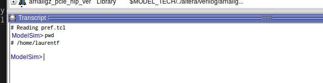

3. Then type `cd <path/to/folder>`

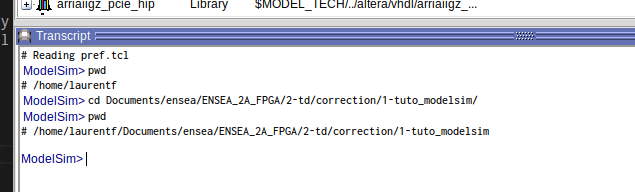

4. Finally, type `do composant_nul.do`. Modelsim should now look like this:

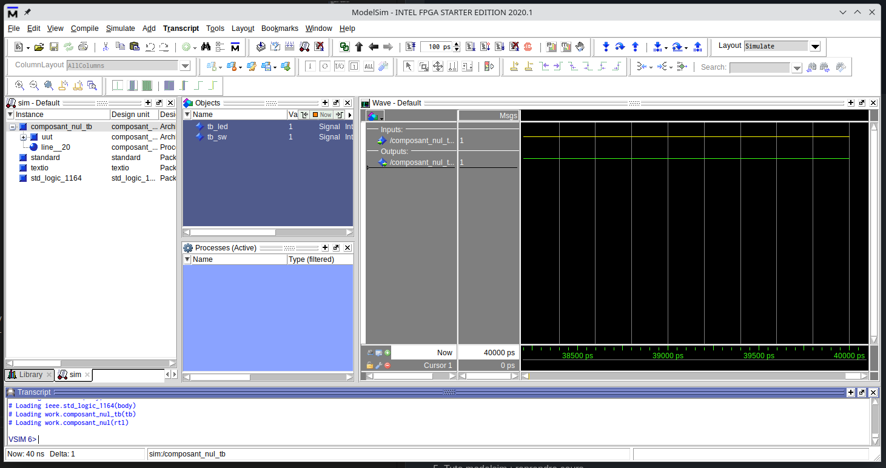

5. You can zoom out to see all your signals by clicking the blue magnifying glass:

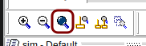

### Encoder/Decoder

To design digital circuits, you will often need to convert signals from one representation to another.
The circuits responsible for these conversions are called encoders or decoders, or more simply, coders.

#### 2-to-4 Decoder

In this exercise, you will write the VHDL code for a 2-to-4 decoder. Here is its truth table:

| in1 | in0 | out3 | out2 | out1 | out0 | 
|:---:|:---:|:----:|:----:|:----:|:----:|
| 0   |   0 |    0 |    0 |    0 |    1 |
| 0   |   1 |    0 |    0 |    1 |    0 |
| 1   |   0 |    0 |    1 |    0 |    0 |
| 1   |   1 |    1 |    0 |    0 |    0 |

In VHDL, there are many different ways to describe a decoder:
* `with ... select`,
* `when ... else`,
* `case ... when` within a `process`,
* `if ... then ... elsif` within a `process`.

1. Create a file decoder.vhd
2. Choose one of these four methods and write the code for a 2-to-4 decoder
3. Simulate it using the following test bench

```vhdl
library ieee;
use ieee.std_logic_1164.all;

entity decoder_tb is
end entity decoder_tb;

architecture tb of decoder_tb is
    signal tb_data_in : std_logic_vector(1 downto 0);
    signal tb_data_out : std_logic_vector(3 downto 0);
begin
    uut : entity work.decoder
        port map (
            data_in => tb_data_in,
            data_out => tb_data_out
        );

    process
    begin
        tb_data_in <= "00";
        wait for 10 ns;
        tb_data_in <= "01";
        wait for 10 ns;
        tb_data_in <= "10";
        wait for 10 ns;
        tb_data_in <= "11";
        wait for 10 ns;
        tb_data_in <= "UU"; -- Undefined inputs, should lead to undefined outputs
        wait for 10 ns;
        wait;
    end process;
end architecture tb;
```

### Multiplexer

The multiplexer is another very commonly used basic circuit. Multiplexers are especially used to implement conditional structures (`if then else`).

1. Write the VHDL code for a 2-to-1 multiplexer with a configurable bus size

> You will need to use the `generic` keyword

2. Test it with a test bench

> In addition to the `port map`, you will need a `generic map` to configure the component

### ALU

The ALU (Arithmetic and Logic Unit) is a component found in almost all microprocessors.
It is a component that allows you to perform a chosen operation on two operands.

In this exercise, your ALU will perform 8 operations:
* Addition
* Subtraction
* Multiplication
* Division
* Logical OR
* Logical AND
* XOR
* Logical NOT (on a single operand)

1. How many selection bits are needed?
2. Propose a diagram (on paper!)
3. Write the VHDL code for the ALU

> You will use signals of type `signed`

> You will need the `numeric_std` library

4. Test it using a test bench

## Session 2: Sequential Circuits

### D Flip-Flop

1. Briefly describe how a D flip-flop works.
2. Create a new file `dff.vhd`.
3. In this file, write the VHDL code for a simple D flip-flop.
4. Write its test bench and simulate it.
5. Add a reset signal. Simulate.
6. Add an enable signal. Simulate.

### Registers (Serial/Parallel)

1. Draw the diagram of a 4-bit serial-in serial-out register.
2. Complete the following timing diagram:
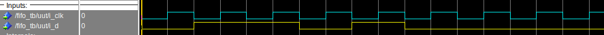
3. Create a file `fifo.vhd`.
4. What signals should be in the sensitivity list?
5. Write the code for a serial-in serial-out register whose depth is configurable using `generic`.

> From this question on, I won't ask again, but every sequential circuit must have a reset signal.

> You will also add an enable signal.

6. Write its test bench and simulate it.

### Counters

1. Draw the basic diagram of a generic counter.
2. Draw the timing diagram of a 2-bit counter.
3. Create a file `counter.vhd`.
4. Write the code for a generic counter.

> Don't forget the reset and enable

5. Write its test bench and simulate it.

### FSM

Here is the code for a sequencer:

```vhdl
library ieee;
use ieee.std_logic_1164.all;

entity fsm is
    port (
        i_clk : in std_logic;
        i_rst_n : in std_logic;

        i_p50 : in std_logic;
        i_p100 : in std_logic;

        o_coffee : out std_logic;
        o_money : out std_logic
    );
end entity fsm;

architecture rtl of fsm is
    type state_t is (ZERO, FIFTY, HUNDRED, ONE_FIFTY, TWO_HUNDREDS);
    signal r_state : state_t := ZERO;
    signal s_next_state : state_t;
begin
    process(i_clk, i_rst_n)
    begin
        if (i_rst_n = '0') then
            r_state <= ZERO;
        elsif (rising_edge(i_clk)) then
            r_state <= s_next_state;
        end if;
    end process;

    process(r_state, i_p50, i_p100)
    begin
        case r_state is
            when ZERO => 
                if (i_p50 = '1') then
                    s_next_state <= FIFTY;
                elsif (i_p100 = '1') then
                    s_next_state <= HUNDRED;
                else
                    s_next_state <= ZERO;
                end if;
            when FIFTY => 
                if (i_p50 = '1') then
                    s_next_state <= HUNDRED;
                elsif (i_p100 = '1') then
                    s_next_state <= ONE_FIFTY;
                else
                    s_next_state <= FIFTY;
                end if;
            when HUNDRED => 
                if (i_p50 = '1') then
                    s_next_state <= ONE_FIFTY;
                elsif (i_p100 = '1') then
                    s_next_state <= TWO_HUNDREDS;
                else
                    s_next_state <= HUNDRED;
                end if;
            when ONE_FIFTY => 
                s_next_state <= ZERO;
            when TWO_HUNDREDS => 
                s_next_state <= ZERO;
            when others => 
                s_next_state <= ZERO;
        end case;
    end process;

    o_coffee <= '1' when (r_state = ONE_FIFTY) or (r_state = TWO_HUNDREDS) else '0';
    o_money <= '1' when (r_state = TWO_HUNDREDS) else '0';
end architecture rtl;
```

1. Why is `r_state` initialized and not `s_next_state`?
2. Justify the signals present in the sensitivity list of the different `process` blocks.
3. Draw the architecture diagram of the component.
4. Identify the parts of the code related to the drawn diagram.
5. Draw the state graph of the sequencer.
6. Complete the following state graph.

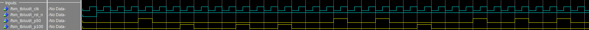

## Session 3: HDMI Controller

The HDMI controller has two roles:
* Generate control signals for the `ADV7513` component present on the DE10-Nano,
* Provide an address to the circuit responsible for generating the pixels.

### Entity

The HDMI controller must be configurable to adapt to different resolutions.
It must therefore have a number of `generic` parameters:
* The resolution `h_res` and `v_res`,
* The specific timings required by the `ADV7513`.

Here are their values for a 480p resolution (720x480):

| param  | value |
|:------:|:-----:|
| h_res  | 720   |
| v_res  | 480   |
| h_sync | 61    |
| h_fp   | 58    |
| h_bp   | 18    |
| v_sync | 5     |
| v_fp   | 30    |
| v_bp   | 9     |

1. Create a file `hdmi_controler.vhd`
2. Write the `generic` part of its `entity`

> The parameters can be of type `positive`

Regarding the input/output signals, they are of three types:
* Clock and reset:
    * i_clk
    * i_rst_n
* Control signals for the `ADV7513` component:
    * o_hdmi_hs
    * o_hdmi_vs
    * o_hdmi_de
* Signals for the pixel-generating circuit:
    * o_pixel_en
    * o_pixel_address
    * o_x_counter
    * o_y_counter

> The address and horizontal/vertical counter signals can be of type `natural`

3. Write the `port` part of the `entity`

### Horizontal Sync

1. Create three constants:
    * h_start : h_sync + h_fp
    * h_end : h_start + h_res
    * h_total : h_end + h_bp
2. What does each of these constants represent?
3. Create two internal registers:
    * r_h_count: to count all pixels (active and inactive)
    * r_h_active: indicates whether pixels are active or not.
4. Create a process sensitive to clock and reset signals.
5. On reset, initialize the following signals:
    * r_h_count to 0,
    * o_hdmi_hs to '1',
    * r_h_active to '0',

The rest of the process will be dedicated to writing three registers:
* r_h_count,
* o_hdmi_hs,
* r_h_active,

6. Write the code for the `r_h_count` counter. It should count from 0 to `h_total`.

> The code should be in the process, on a rising clock edge

7. Write the code for the `o_hdmi_hs` register. It should be '1' if `r_h_count >= h_sync` and `r_h_count /= h_total`.

> This register is described in the same process and clock condition as the previous register

8. Write the code for the `r_h_active` register. It goes to '1' when `r_h_count = h_start` and goes to '0' when `h_count = h_end`.

> This register is described in the same place as the previous two.

9. Write a testbench and simulate in Modelsim.

The signals `o_hdmi_hs` and `r_h_active` should look like this:

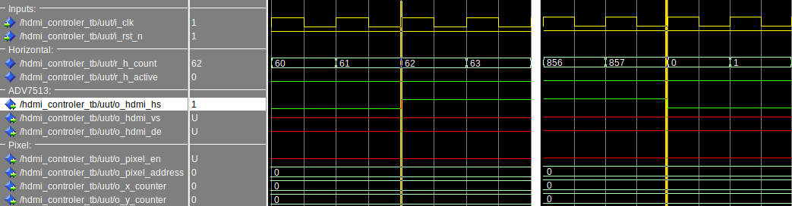
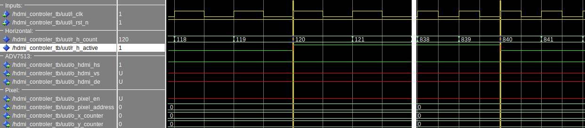

### Vertical Sync

The structure responsible for vertical synchronization is very similar to horizontal synchronization. The main difference is that the counter is only allowed to change value when the horizontal counter finishes its line (`h_count = h_total`).

1. Using the horizontal sync as inspiration, create three constants:
    * `v_start`
    * `v_end`
    * `v_total`
2. Create two internal registers:
    * `r_v_count`
    * `r_v_active`
3. Create a process sensitive to clock and reset signals.
4. Write the reset initializations.
5. Write the code for the counter from 0 to `v_total`.
6. Write the code for the output signal `o_hdmi_vs`.
7. Write the code for the `r_h_active` register.
8. Update your testbench and simulate in Modelsim.

The signals `r_v_count`, `o_hdmi_vs` and `r_v_active` should look like this:

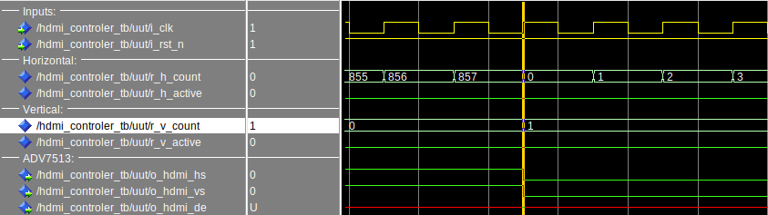
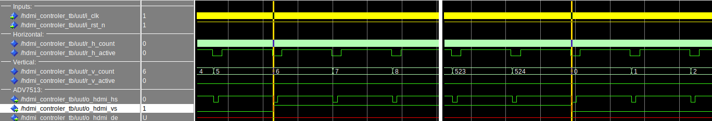
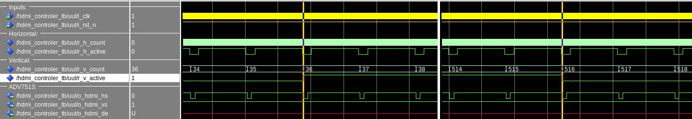

### Data Enable: Active Pixels

This part is simpler, you will describe the output register `o_hdmi_de`.

1. Create a new process sensitive to clock and reset.
2. On reset, the output `o_hdmi_de` takes the value '0'.
3. On rising edge: `o_hdmi_de <= r_v_active and r_h_active;`

### Address and Coordinate Generator

1. Write the code to generate the `o_pixel_en` signal

> It should be '1' when both r_v_active and r_h_active are '1'

2. Write the code to generate the `o_x_counter`, `o_y_counter` signals.

> These signals represent the **active** pixels. (0,0) is the first pixel at the top left.

3. Write the code for the `o_pixel_address` signal

> This signal goes from 0 to (h_res * v_res) - 1 when pixels are active. Here, pixel 0 is the first pixel of the first line, 720 for the first pixel of the second line, 1440 for the third, etc.

### Analysis
1. Draw the architecture diagram of the complete system
