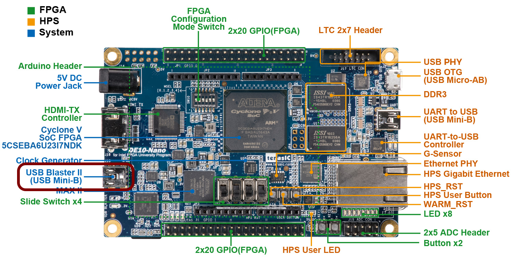
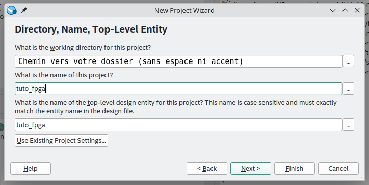
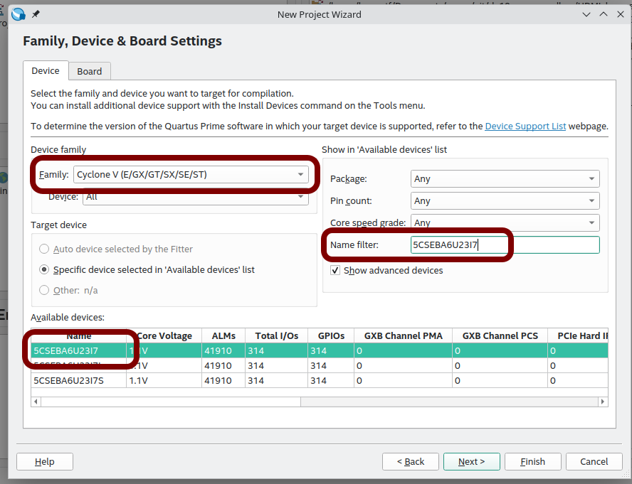
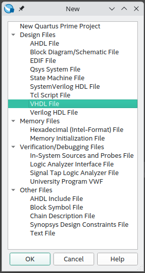
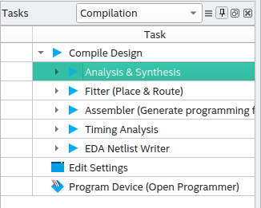
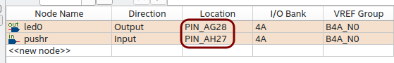
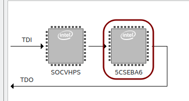
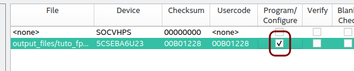
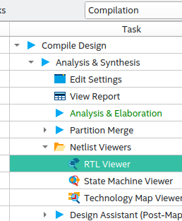
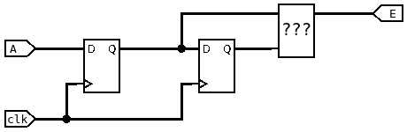

# TP FPGA

## TP1 : Tutoriel Quartus

En TD, vous avez utilisé le logiciel Modelsim pour simuler vos composants VHDL. Pour les tester sur FPGA, vous aurez besoin du logiciel Quartus Prime. Ce TP est écrit sur la version 24.1, mais devrait se transposer facilement sur d'autres versions. Choisissez la version _Lite Edition_, seule version gratuite. 

[Lien vers la version 24.1 de Quartus Prime Lite](https://www.intel.fr/content/www/fr/fr/software-kit/849770/intel-quartus-prime-lite-edition-design-software-version-24-1-for-windows.html). Disponible sous Windows et Linux.

### Branchement de la carte

Avant de brancher la carte, retirez l'éventuelle carte SD présente dans son support, à l'arrière de la carte.

Pour fonctionner, la carte doit être alimentée. Le courant fourni par le port USB n'est pas suffisant, il faut ajouter une alimentation extérieure.

La carte est programmée par le port USB nommé ```USB BLASTER II```. Il se situe du même côté que le connecteur d'alimentation et que le port HDMI. La carte **ne peut pas être programmée** par les autres ports USB.



### Création d'un projet
1. Lancez Quartus
2. Lancez l'assistant de création de projet :
> File > New Project Wizard
3. La première page ne sert à rien, cliquez sur ```Next```
4. Sur la deuxième page, choisissez un nom (par exemple ```tuto_fpga```) et un chemin.
**Attention** : Pas d’espaces ni de caractères spéciaux !

5. Cliquez sur ```Next```
6. Sur la page suivante, sélectionnez ```Empty project``` puis cliquez sur ```Next```
7.  La page suivante permet d’ajouter des fichier. Nous n’en avons pas besoin, cliquez sur ```Next```
8. La page suivante est importante, elle permet de choisir le FPGA cible.  **Faites attention à ne pas faire d’erreur.** Le FPGA à sélectionner est le suivant :
```5CSEBA6U23I7```

Ni ~~5CSEBA6U23I7L~~, ni ~~5CSEBA6U23I7S~~. Cliquez sur ```Next```



9. La page suivante ne nous interesse pas non plus, cliquez sur ```Next```
10. La dernière page est un récapitulatif, cliquez sur ```Finish```

### Création d'un fichier VHDL

1. Créez un nouveau fichier
> File > New
2. Une fenêtre s'ouvre, sélectionez
> VHDL File



3. Écrivez un composant simple, comme celui-là :

```vhdl
library ieee;
use ieee.std_logic_1164.all;

entity tuto_fpga is
    port (
        pushl : in std_logic;
        led0 : out std_logic
    );
end entity tuto_fpga;

architecture rtl of tuto_fpga is
begin
    led0 <= pushl;
end architecture rtl;
```

4. **Important** : Le nom de l'```entity``` doit être le même que le nom du projet.
5. Respectez l'indentation

> Ce composant simple permet d'allumer la LED0 lorsque le bouton poussoir de l'encodeur de gauche est enfoncé.

### Fichier de contraintes

> ```LED0``` est sur la broche ```PIN_AG28```

> ```pushl``` est sur la broche ```PIN_AH27```

Quartus ne peut pas conniitre ces informations, il faut donc lui préciser.
1. Avant toute chose, il faut _synthétiser_ le projet

> Double-cliquez sur ```Analysis & Synthesis```



2. Ensuite, cherchez dans la barre de menu :

> Assignments > Pin Planner

3. Les signaux d’entrée/sortie définis dans l’entity VHDL sont listés en bas de la fenêtre qui vient de s’ouvrir. Configurez-les de la manière suivante :



4. Vous pouvez fermer la fenêtre du ```Pin Planner```, la sauvegarde est automatique

### Compilation et programmation de la carte

1. Compilez l'intégralité du projet

> Double-cliquez sur ```Compile Design```

**Note :** Il y a quelques _warnings_. On ne s'en occupe pas pour l'instant.

2. Lancer l’outil de programmation du FPGA

> Tools > Programmer

3. Une fenêtre s'ouvre : 

> Cliquez sur ```Auto Detect```

4. Deux fenêtres pop-up apparaissent successivements, acceptez les paramètres
par défaut

5. Sélectionnez la puce notée ```5CSEBA6```



6. Chargez le _bitstream_

> Clic-droit sur la puce > Edit > Change File

> Sélectionnez le fichier ```.sof``` dans le dossier ```output_files```

7. Cochez la case ```Program/Configure```


8. Programmez la carte

> Cliquez sur ```Start```

9. Ça fonctionne ?

10. Le comportement est inversé! La LED est allumée par défaut et s'éteind lorsque l'on appuie sur l'encodeur. On voulait l'inverse. Modifiez le VHDL, compilez, programmez.

### Faire clignoter une LED

Le combinatoire c'est bien, le séquentiel c'est mieux.

1. Plusieurs horloges sont disponibles sur la carte. Sur quelle broche est connectée l’horloge nommée FPGA_CLK1_50 ?

> L'information se trouve dans le ```User Manual```, disponible en suivant [ce lien](DE10-Nano_User_manual.pdf)

2. Le code VHDL ci-dessous permet de faire simplement clignoter une LED


```vhdl
library ieee;
use ieee.std_logic_1164.all;

entity led_blink is
    port (
        i_clk : in std_logic;
        i_rst_n : in std_logic;
        o_led : out std_logic
    );
end entity led_blink;

architecture rtl of led_blink is
    signal r_led : std_logic := '0';
begin
    process(i_clk, i_rst_n)
    begin
        if (i_rst_n = '0') then
            r_led <= '0';
        elsif (rising_edge(i_clk)) then
            r_led <= not r_led;
        end if;
    end process;
    o_led <= r_led;
end architecture rtl;
```

3. Tracez le schéma correspondant à ce code VHDL
4. Comparez avec le schéma proposé par quartus :

> Dans la zone de compilation, ouvrir Compile Design > Analysis & Syn-
thesis > Netlist Viewers puis lancer ```RTL Viewer```



5. Ce n’est pas la peine de tester ce code sur la carte, la LED clignote à 50MHz : c’est trop rapide.
6. En vous aidant du code ci-dessous, modifiez votre code pour réduire la fré
quence :

```vhdl
process(i_clk, i_rst_n)
    variable counter : natural range 0 to 5000000 := 0;
begin
    if (i_rst_n = '0') then
        counter := 0;
        r_led_enable <= '0';
    elsif (rising_edge(i_clk)) then
        if (counter = 5000000) then
            counter := 0;
            r_led_enable <= '1';
        else
            counter := counter + 1;
            r_led_enable <= '0';
        end if;
    end if;
end process;
```

7. Proposez un schéma correspondant au nouveau code
8. Vérifiez à l’aide de RTL Viewer

> Comme vous l’avez peut-être remarqué :
> * Les entrées commencent par ```i_```
> * Les sorties commencent par ```o_```
> * Les registres commencent par ```r_```
> * Il n’y en a pas ici, mais les signaux internes commencent par ```s_```
> 
> C’est une bonne habitude à prendre.

Vous noterez également l’utilisation d’un signal de reset : ```i_rst_n```.

9. C’est important d’avoir un signal de ```reset```, utilisez-le pour chacun de vos registres
10. Vous utiliserez le bouton poussoir nommé ```KEY0``` (```AH17``` sur le FPGA).
11. Que sigifie ```_n``` dans ```i_rst_n``` ? Pourquoi ?

### Chenillard !
Eh oui, vous vous en doutiez, ça devait arriver à un moment ou à un autre. Vous plongez maintenant dans le grand bain, vous allez devoir concevoir votre propre composant. Sans aide, sans guidage. À vous de jouer :

> Concevez un chenillard

Et montrez le résultat (et le code!) à votre encadrant.

## Petit projet : Écran magique

Si vous êtes plus jeune que M. Tauvel, vous ne savez peut-être pas ce qu'est un écran magique, aussi appelé télécran.
C'est pas grave, vous trouverez toutes les informations ici : [https://fr.wikipedia.org/wiki/Écran_magique](https://fr.wikipedia.org/wiki/Écran_magique)
En gros, c'est comme un ipad, mais dans les années 60.

Ce petit projet en 3 séances vous propose de concevoir une version numérique du télécran, en utilisant la sortie HDMI de la carte DE10-Nano. Le _stylet_ numérique sera toujours déplacé par deux boutons, les deux encodeurs de la carte mezzanine.

Il est découpé en 5 sous-parties, qui ne sont volontairement pas très détaillées. Pour chaque partie, vous aurez à suivre la démarche suivante :
1. Concevoir un schéma pour répondre à la problématique
2. Implémenter la solution en VHDL
3. Simuler cette solution
4. Tester sur la carte

Vous serez tenté de sauter la partie simulation, mais vous risquez de perdre du temps au final.

### Gestion des encodeurs

Dans cette partie, vous mettrez l'affichage de côté pour vous focaliser sur les encodeurs.

L'objectif est d'incrémenter la valeur d'un registre lorsque l'on tourne l'encodeur vers la droite, et de le décrémenter lorsqu'on le tourne vers la gauche. La taille du registre doit être configurable. On pourra choisir une taille de 10 dans cette partie pour afficher la valeur en binaire sur les LED.

Un encodeur renvoie deux signaux A et B en quadrature.

* Il y a deux conditions possible pour incrémenter le registre :
    1. Front montant sur A et B à l'état bas
    2. Front descendant sur A et B à l'état haut
* Il y a deux conditions possible pour décrémenter le registre :
    1. Front montant sur B et A à l'état bas
    2. Front descendant sur B et A à l'état haut

Vous aurez besoin d'une structure de ce type pour détecter les fronts montants :



1. À partir d'ici, vous travaillerez dans le projet fourni par [ce lien](telecran.zip).
2. À l'aide du schéma ci-dessus, expliquez comment un front montant ou descendant peut être détecté.

> Vous aurez besoin de faire évoluer cette structure, notamment en prenant en compte la voie B, pour prendre en compte les deux sens de rotation

3. Implémenter la solution en VHDL.
4. Simuler cette solution.
5. Tester sur la carte.
6. Montrez à l'enseignant.

### Comment visualiser la sortie HDMI ?

Vous n'allez pas passer votre temps à débrancher votre écran.
Les salles de TP sont équipées d'adaptateurs HDMI vers USB.


1. Branchez le cable HDMI à votre carte et à l'adaptateur. Branchez le port USB à l'ordinateur.
2. Lancez le logiciel VLC.
3. Ouvrir un nouveau ```capture device```.

> Media > Open Capture Device

4. Ajoutez l'adaptateur dans ```Video device name```.

### Contrôleur HDMI

Cette partie du projet consiste à mettre en oeuvre le contrôleur HDMI conçu en TD.

1. Si ce n'est pas fait, finissez le TD 3. Simulez le composant.

> Les timings doivent être rigoureusement identiques aux captures d'écran du TD.

2. Ajoutez le fichier ```hdmi_controler.vhd``` au projet.
3. Instanciez le composant ```hdmi_controler``` dans votre fichier top (```telecran.vhd```).

> Utilisez l'horloge et le reset produis par la PLL
> ```vhdl
> i_clk => s_clk_27,
> i_rst_n => s_rst_n,
> ```
> 
> Certains signaux ne sont pas utilisés ici
> ```vhdl
> o_pixel_en => open,
> o_pixel_address => open,
> ```

4. Connectez les sorties pixel (signal ```o_hdmi_tx_d```) aux compteurs x, y.

> Par exemple :
> ```vhdl
> o_hdmi_tx_d(23 downto 16) <= std_logic_vector(to_unsigned(s_x_counter, 8));
> o_hdmi_tx_d(15 downto 8) <= std_logic_vector(to_unsigned(s_y_counter, 8));
> o_hdmi_tx_d(7 downto 0) <= (others => '0');
> ```

5. À quels bits correspondent chaque composante couleur ?

6. Compilez et testez.

7. Montrez à l'enseignant.

### Déplacement d'un pixel

Cette étape du projet consiste à afficher un seul et unique pixel qui se déplace en fonction des deux encodeurs.
L'encodeur gauche déplace le pixel à l'horizontal, l'encodeur gauche déplace le pixel à la verticale.

Cette étape devrait être assez simple. Il faut attribuer la valeur _blanche_ (```x"FFFFFF"```) au signal ```o_hdmi_tx_d``` quand les valeurs x et y des encodeurs sont égales à celles des compteurs du contrôleur HDMI. Dans le cas contraire, vous pourrez attribuer la valeur _noire_ (```x"000000"```).

1. Modifiez le fichier ```telecran.vhd``` pour prendre en compte cette modification.
2. Testez (il ne devrait rien avoir à simuler ici).
3. Montrez à votre enseignant.

### Mémorisation

Cette partie est un peu plus complexe. On veut mémoiriser les pixels parcourus pour afficher le dessin, comme sur un véritable écran magique.
Il faudra utiliser un _framebuffer_ pour stocker les pixels déjà allumés. Le code d'une mémoire est fourni dans le fichier ```dpram.vhd```. Il s'agit d'une mémoire RAM _dual-port_.

1. Expliquez ce qu'est une mémoire _dual-port_.
2. Proposer un schéma pour mémoiriser les pixels.

> Le port A de la mémoire RAM pourra être utilisé pour l'écriture des pixels en fonction des coordonnées générées par les encodeurs.
> Le port B quant à lui pourra être utilisé pour la lecture des pixels par le controleur HDMI.

3. Instanciez le composant ```dpram``` dans le fichier ```telecran.vhd``` et effectuez les connexions nécessaires.
4. Modifiez encore une fois le signal ```o_hdmi_tx_d```.
5. Testez.
6. Montrez à l'enseignant.

### Effacement

Ici on veut pouvoir effacer l'écran lors de l'appui sur un bouton (par exemple sur l'encodeur gauche).
C'est plus compliqué qu'il n'y parait : Il faut parcourir toutes les adresses de la RAM pour y écrire un zéro.
C'est le dernier exercice, ici vous ne serez plus guidés.

1. Expliquez comment résoudre le problème
2. Résolvez le problème
3. Montrez à l'enseignant.

# Annexe

## Contraintes carte TELECRAN

J2 correspond à GPIO0
J1 correspond à GPIO1

### LEDs
| Nom  | GPIO  | FPGA |
| :--- |:-----:| ----:|
| LED0 | J1:5  | AG28 |
| LED1 | J1:7  | AE25 |
| LED2 | J1:9  | AG26 |
| LED3 | J1:13 | AG25 |
| LED4 | J1:17 | AG23 |
| LED5 | J1:21 | AH21 |
| LED6 | J1:25 | AF22 |
| LED7 | J1:27 | AG20 |
| LED8 | J1:33 | AG18 |
| LED9 | J1:37 | AG15 |

### Encodeurs
| Nom      | GPIO  | FPGA |
| :------- |:-----:| ----:|
| LEFT_PB  | J1:10 | AH27 |
| LEFT_A   | J1:8  | AF27 |
| LEFT_B   | J1:6  | AF28 |
| RIGHT_PB | J2:40 | AA11 |
| RIGHT_A  | J2:38 | AA26 |
| RIGHT_B  | J2:39 | AA13 |

### ADXL345
| Nom  | GPIO  | FPGA |
| :--- |:-----:| ----:|
| INT1 | J2:33 | Y18  |
| INT2 | J2:34 | Y17  |
| nCS  | J2:32 | W14  |
| SCL  | J2:37 | Y11  |
| SDA  | J2:36 | AB26 |
| SDO  | J2:35 | AB25 |

