# FPGA Lab

## Lab 1: Quartus Tutorial

In the tutorial, you used Modelsim to simulate your VHDL components. To test them on an FPGA, you will need Quartus Prime. This lab is written for version 24.1, but it should be easily adaptable to other versions. Choose the _Lite Edition_, the only free version.

[Link to Quartus Prime Lite version 24.1](https://www.intel.fr/content/www/fr/fr/software-kit/849770/intel-quartus-prime-lite-edition-design-software-version-24-1-for-windows.html). Available for Windows and Linux.

### Connecting the Board

Before connecting the board, remove any SD card present in its slot, at the back of the board.

To operate, the board must be powered. The current supplied by the USB port is not sufficient; you need to add an external power supply.

The board is programmed via the USB port named `USB BLASTER II`. It is located on the same side as the power connector and the HDMI port. The board **cannot be programmed** via the other USB ports.

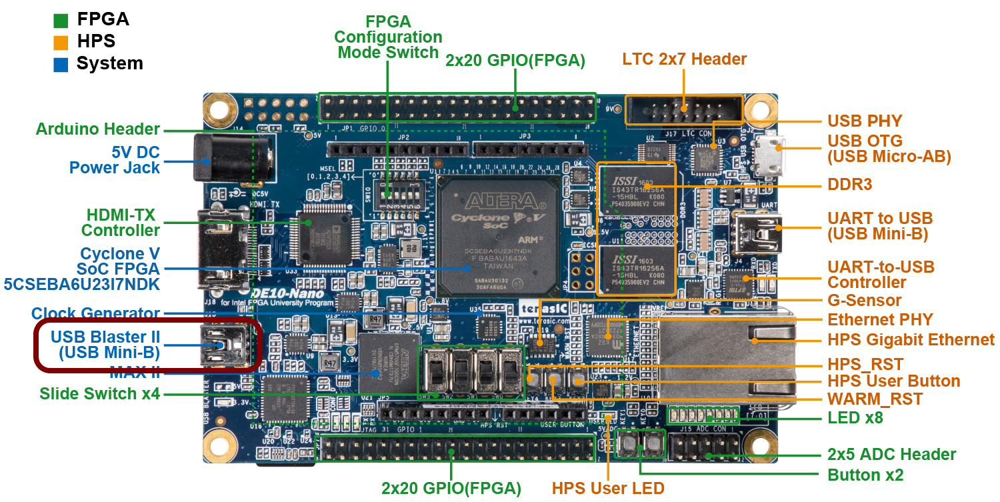

### Creating a Project
1. Launch Quartus
2. Start the project creation wizard:
> File > New Project Wizard
3. The first page is useless, click `Next`
4. On the second page, choose a name (e.g., `tuto_fpga`) and a path.
**Warning:** No spaces or special characters!
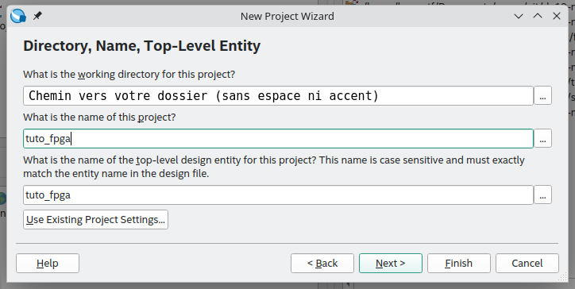
5. Click `Next`
6. On the next page, select `Empty project` then click `Next`
7. The next page allows you to add files. We don't need this, click `Next`
8. The next page is important, it lets you choose the target FPGA. **Be careful not to make a mistake.** The FPGA to select is:
`5CSEBA6U23I7`

Not ~~5CSEBA6U23I7L~~, nor ~~5CSEBA6U23I7S~~. Click `Next`

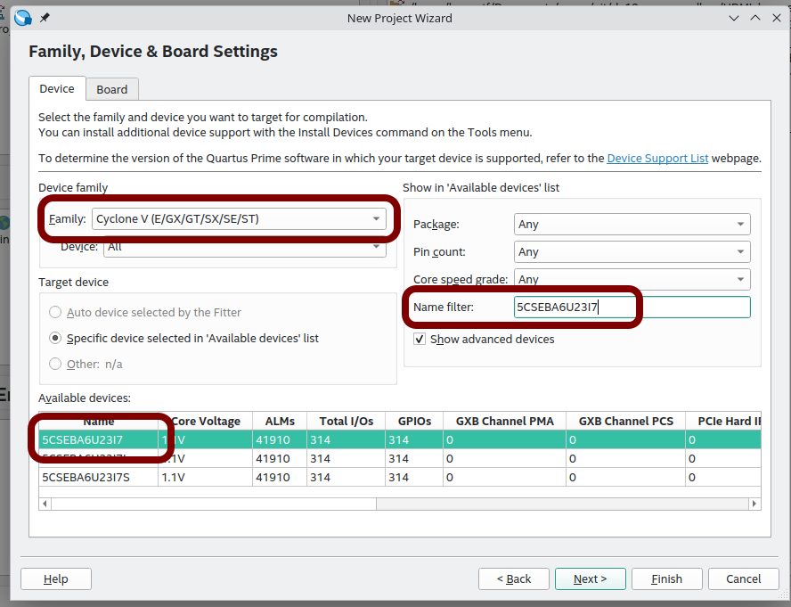

9. The next page is not relevant either, click `Next`
10. The last page is a summary, click `Finish`

### Creating a VHDL File

1. Create a new file
> File > New
2. A window opens, select
> VHDL File

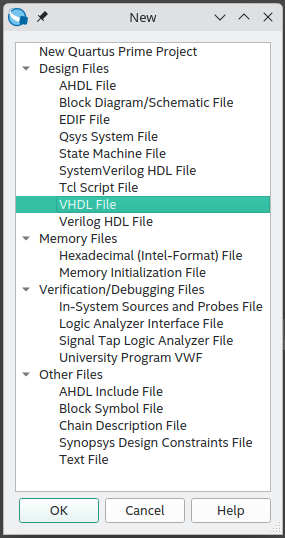

3. Write a simple component, like this:

```vhdl
library ieee;
use ieee.std_logic_1164.all;

entity tuto_fpga is
    port (
        pushl : in std_logic;
        led0 : out std_logic
    );
end entity tuto_fpga;

architecture rtl of tuto_fpga is
begin
    led0 <= pushl;
end architecture rtl;
```

4. **Important:** The name of the `entity` must be the same as the project name.
5. Respect indentation

> This simple component turns on LED0 when the left encoder push button is pressed.

### Constraints File

> `LED0` is on pin `PIN_AG28`
> 
> `pushl` is on pin `PIN_AH27`

Quartus cannot know this information, so you must specify it.
1. First, you need to _synthesize_ the project

> Double-click on `Analysis & Synthesis`

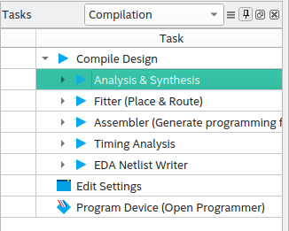

2. Then, look in the menu bar:

> Assignments > Pin Planner

3. The input/output signals defined in the VHDL entity are listed at the bottom of the window that just opened. Configure them as follows:

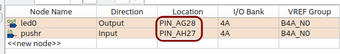

4. You can close the `Pin Planner` window, saving is automatic

### Compiling and Programming the Board

1. Compile the entire project

> Double-click on `Compile Design`

**Note:** There are some warnings. Ignore them for now.

2. Launch the FPGA programming tool

> Tools > Programmer

3. A window opens:

> Click on `Auto Detect`

4. Two pop-up windows appear successively, accept the default parameters

5. Select the chip labeled `5CSEBA6`

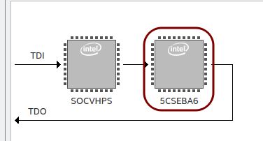

6. Load the bitstream

> Right-click on the chip > Edit > Change File
> 
> Select the `.sof` file in the `output_files` folder

7. Check the `Program/Configure` box
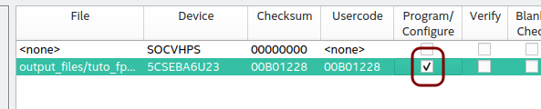

8. Program the board

> Click on `Start`

9. Does it work?

10. The behavior is inverted! The LED is on by default and turns off when the encoder is pressed. We wanted the opposite. Modify the VHDL, compile, program.

### Blinking an LED

Combinatorial logic is good, sequential is better.

1. Several clocks are available on the board. On which pin is the clock named FPGA_CLK1_50 connected?

> The information is in the `User Manual`, available at [this link](DE10-Nano_User_manual.pdf)

2. The VHDL code below simply blinks an LED

```vhdl
library ieee;
use ieee.std_logic_1164.all;

entity led_blink is
    port (
        i_clk : in std_logic;
        i_rst_n : in std_logic;
        o_led : out std_logic
    );
end entity led_blink;

architecture rtl of led_blink is
    signal r_led : std_logic := '0';
begin
    process(i_clk, i_rst_n)
    begin
        if (i_rst_n = '0') then
            r_led <= '0';
        elsif (rising_edge(i_clk)) then
            r_led <= not r_led;
        end if;
    end process;
    o_led <= r_led;
end architecture rtl;
```

3. Draw the diagram corresponding to this VHDL code
4. Compare with the diagram proposed by Quartus:

> In the compilation area, open Compile Design > Analysis & Synthesis > Netlist Viewers then launch `RTL Viewer`

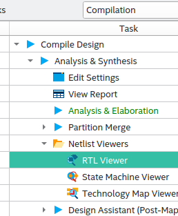

5. No need to test this code on the board, the LED blinks at 50MHz: it's too fast.
6. Using the code below, modify your code to reduce the frequency:

```vhdl
process(i_clk, i_rst_n)
    variable counter : natural range 0 to 5000000 := 0;
begin
    if (i_rst_n = '0') then
        counter := 0;
        r_led_enable <= '0';
    elsif (rising_edge(i_clk)) then
        if (counter = 5000000) then
            counter := 0;
            r_led_enable <= '1';
        else
            counter := counter + 1;
            r_led_enable <= '0';
        end if;
    end if;
end process;
```

7. Propose a diagram corresponding to the new code
8. Check using RTL Viewer

> As you may have noticed:
> * Inputs start with `i_`
> * Outputs start with `o_`
> * Registers start with `r_`
> * There are none here, but internal signals start with `s_`
> 
> It's a good habit to take.

You will also note the use of a reset signal: `i_rst_n`.

9. It's important to have a `reset` signal, use it for each of your registers
10. You will use the push button named `KEY0` (`AH17` on the FPGA).
11. What does `_n` mean in `i_rst_n`? Why?

### Chaser!
Yes, you guessed it, it had to happen at some point. Now you're in the deep end, you will have to design your own component. No help, no guidance. Your turn:

> Design a chaser

And show the result (and the code!) to your supervisor.

## Small Project: Magic Screen

If you are younger than Mr. Tauvel, you may not know what a magic screen is, also called an Etch A Sketch.
That's okay, you'll find all the information here: [https://en.wikipedia.org/wiki/Etch_A_Sketch](https://en.wikipedia.org/wiki/Etch_A_Sketch)
Basically, it's like an iPad, but from the 60s.

This small project in 3 sessions proposes to design a digital version of the Etch A Sketch, using the HDMI output of the DE10-Nano board. The digital "stylus" will always be moved by two buttons, the two encoders on the mezzanine board.

It is divided into 5 sub-parts, which are intentionally not very detailed. For each part, you will follow this approach:
1. Design a diagram to address the problem
2. Implement the solution in VHDL
3. Simulate this solution
4. Test on the board

You will be tempted to skip the simulation part, but you may end up wasting time.

### Encoder Management

In this part, you will set aside the display to focus on the encoders.

The goal is to increment the value of a register when the encoder is turned to the right, and decrement it when turned to the left. The register size must be configurable. You can choose a size of 10 in this part to display the value in binary on the LEDs.

An encoder returns two signals A and B in quadrature.

* There are two possible conditions to increment the register:
    1. Rising edge on A and B is low
    2. Falling edge on A and B is high
* There are two possible conditions to decrement the register:
    1. Rising edge on B and A is low
    2. Falling edge on B and A is high

You will need a structure like this to detect rising edges:

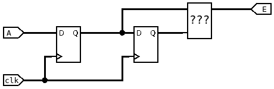

1. From here, you will work in the project provided by [this link](telecran.zip).
2. Using the diagram above, explain how a rising or falling edge can be detected.

> You will need to evolve this structure, especially by taking into account channel B, to handle both rotation directions

3. Implement the solution in VHDL.
4. Simulate this solution.
5. Test on the board.
6. Show your teacher.

### How to View the HDMI Output?

You are not going to keep unplugging your screen.
The lab rooms are equipped with HDMI to USB adapters.

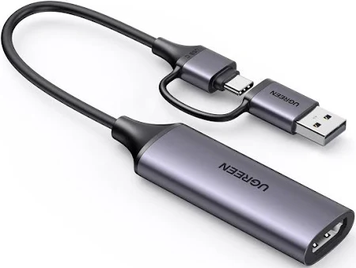

1. Connect the HDMI cable to your board and to the adapter. Connect the USB port to the computer.
2. Launch VLC.
3. Open a new `capture device`.

> Media > Open Capture Device

4. Add the adapter in `Video device name`.

### HDMI Controller

This part of the project consists in implementing the HDMI controller designed in the tutorial.

1. If not done, finish tutorial 3. Simulate the component.

> The timings must be strictly identical to the screenshots from the tutorial.

2. Add the file `hdmi_controler.vhd` to the project.
3. Instantiate the `hdmi_controler` component in your top file (`telecran.vhd`).

> Use the clock and reset produced by the PLL
> ```vhdl
> i_clk => s_clk_27,
> i_rst_n => s_rst_n,
> ```
> 
> Some signals are not used here
> ```vhdl
> o_pixel_en => open,
> o_pixel_address => open,
> ```

4. Connect the pixel outputs (signal `o_hdmi_tx_d`) to the x, y counters.

> For example:
> ```vhdl
> o_hdmi_tx_d(23 downto 16) <= std_logic_vector(to_unsigned(s_x_counter, 8));
> o_hdmi_tx_d(15 downto 8) <= std_logic_vector(to_unsigned(s_y_counter, 8));
> o_hdmi_tx_d(7 downto 0) <= (others => '0');
> ```

5. Which bits correspond to each color component?

6. Compile and test.

7. Show your teacher.

### Moving a Pixel

This step of the project consists in displaying a single pixel that moves according to the two encoders.
The left encoder moves the pixel horizontally, the right encoder moves the pixel vertically.

This step should be quite simple. You need to assign the _white_ value (`x"FFFFFF"`) to the `o_hdmi_tx_d` signal when the x and y values from the encoders match those of the HDMI controller counters. Otherwise, you can assign the _black_ value (`x"000000"`).

1. Modify the `telecran.vhd` file to implement this change.
2. Test (there should be nothing to simulate here).
3. Show your teacher.

### Memory

This part is a bit more complex. We want to remember the pixels that have been traversed to display the drawing, like on a real Etch A Sketch.
A _framebuffer_ will be needed to store the already lit pixels. The code for a memory is provided in the `dpram.vhd` file. It is a _dual-port_ RAM.

1. Explain what a _dual-port_ memory is.
2. Propose a diagram to memorize the pixels.

> Port A of the RAM can be used to write pixels based on the coordinates generated by the encoders.
> Port B can be used to read pixels by the HDMI controller.

3. Instantiate the `dpram` component in the `telecran.vhd` file and make the necessary connections.
4. Modify the `o_hdmi_tx_d` signal again.
5. Test.
6. Show your teacher.

### Erasing

Here we want to be able to erase the screen when pressing a button (for example, on the left encoder).
It's more complicated than it seems: you have to go through all the RAM addresses to write a zero.
This is the last exercise, you are no longer guided here.

1. Explain how to solve the problem
2. Solve the problem
3. Show your teacher.

# Appendix

## TELECRAN Board Constraints

J2 corresponds to GPIO0
J1 corresponds to GPIO1

### LEDs
| Name  | GPIO  | FPGA |
| :--- |:-----:| ----:|
| LED0 | J1:5  | AG28 |
| LED1 | J1:7  | AE25 |
| LED2 | J1:9  | AG26 |
| LED3 | J1:13 | AG25 |
| LED4 | J1:17 | AG23 |
| LED5 | J1:21 | AH21 |
| LED6 | J1:25 | AF22 |
| LED7 | J1:27 | AG20 |
| LED8 | J1:33 | AG18 |
| LED9 | J1:37 | AG15 |

### Encoders
| Name      | GPIO  | FPGA |
| :------- |:-----:| ----:|
| LEFT_PB  | J1:10 | AH27 |
| LEFT_A   | J1:8  | AF27 |
| LEFT_B   | J1:6  | AF28 |
| RIGHT_PB | J2:40 | AA11 |
| RIGHT_A  | J2:38 | AA26 |
| RIGHT_B  | J2:39 | AA13 |

### ADXL345
| Name  | GPIO  | FPGA |
| :--- |:-----:| ----:|
| INT1 | J2:33 | Y18  |
| INT2 | J2:34 | Y17  |
| nCS  | J2:32 | W14  |
| SCL  | J2:37 | Y11  |
| SDA  | J2:36 | AB26 |
| SDO  | J2:35 | AB25 |

## Saving Your Project

Quartus generates a lot of large files.
Before copying your project, you can delete the following folders:
* `db`
* `incremental_db`
* `output_files`

If you use git, add these folders to the `.gitignore` file, as well as the following files:
* `c5_pin_model_dump.txt`
* `*.bak`
* `*.qws`
