# TD FPGA Avancé

## Séance 0 : Simulation du NIOS V

### Création du SOPC

Ce TP est facultatif et sert de référence, il est principalement à destination des profs, mais vous pouvez le faire à la maison.
Le but est d'apprécier (ou pas) le temps de simulation d'un système complet. On le fera peut-être au TD 3, mais au point où j'en suis de l'écriture des TD, je ne suis pas encore sûr de mon coup.

1. ~~Lancer ```Quartus```, créez un projet intitulé ```tuto_nios_sim```. Même si nous travaillons en simulation, il faut choisir un FPGA. Autant prendre le même que d'habitude : ```5CSEBA6U23I7```. Pour le reste, paramètres par défaut.~~
Il n'est pas nécessaire de créer un projet ```Quartus``` pour lancer ```Platform Designer```.
2. Depuis ```Quartus```, lancez ```Platform Designer```

> Tools > Platform Designer

3. Sauvegardez. Appelez le ```tuto_nios_sim.qsys```

4. Ajoutez le processeur

> Processors and Peripherals > Embedded Processors > Nios V/m Compact Microcontroller Intel FPGA IP

5. Dans les options du processeur, activez l'option ```Enable Reset from Debug Module```

6. Ajoutez une mémoire _On-Chip_. Configurez ```Total memory size``` à ```131072```

> Basic Functions > On Chip Memory > On-Chip Memory (RAM or ROM) Intel FPGA IP

Dans ```Memory initialization```, sélectionnez ```Enable non-default initialization file```, et nommez le fichier ```main.hex```.

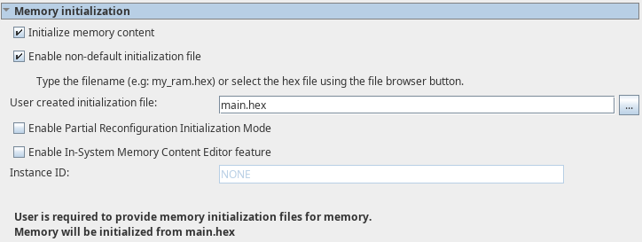

7. Ajoutez le module jtag uart.

> Interface Protocols > JTAG UART Intel FPGA IP

8. Ajoutez un PIO. Configurez ```Width``` à ```32```

> Processors and Peripherals > Peripherals > PIO (Parallel I/O) Intel FPGA IP

9. Exportez ```external_connection```


10. Connectez l'horloge à tous les composants comme sur la figures suivante :

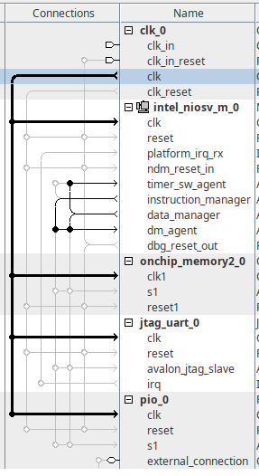

11. Connectez le signal ```clk_reset``` et ```dbg_reset_out``` selon la figure suivante :

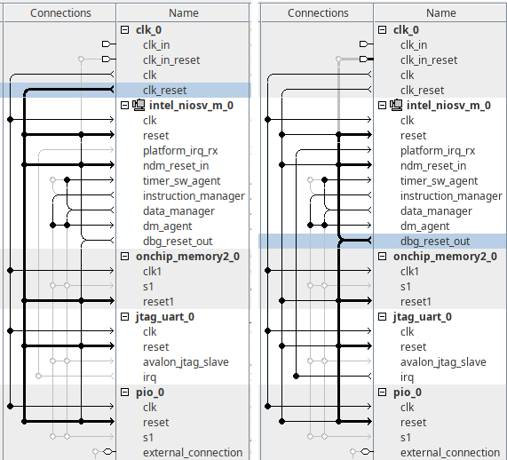

12. Connectez le signal ```instruction_manager``` du processeur au signal ```s1``` de la mémoire :


13. Connectez le signal ```data_manager``` aux autres composants :

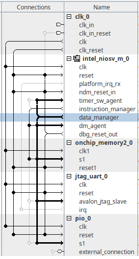

14. Générez les adresses.

> System > Assign Base Addresses

15. Configurez le vecteur de reset :

> Double-cliquez sur le processeur ```intel_niosv_m_0```
> Dans la section ```Traps, Exceptions and Interrupts```, configurez ```Reset Agent``` sur ```on_chip_memory2_0.s1```

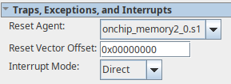

16. Sauvegardez.

17. Générez le code HDL et fermez Platform Designer.

> Cliquez sur Generate HDL. Dans ```Synthesis```, gardez ```Verilog```, Dans ```Simulation```, choisissez ```Verilog``` également. 

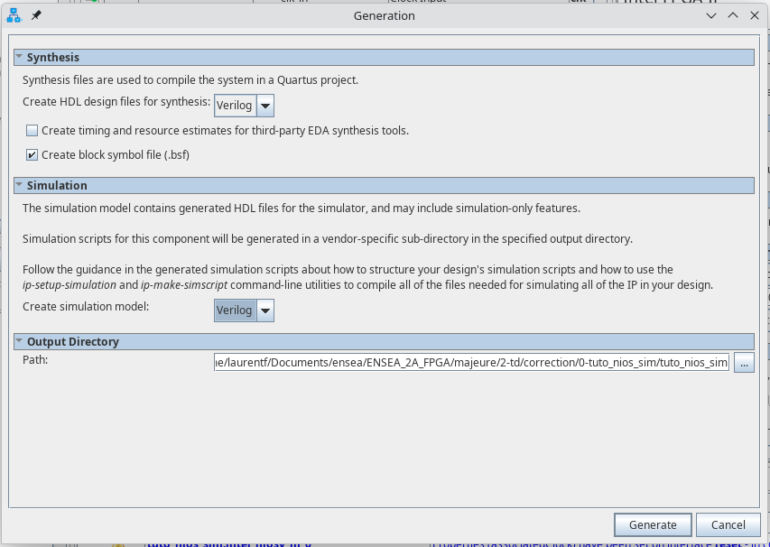

18. Générez le testbench, laissez les paramètres par défaut.

> Generate > Generate Testbench System

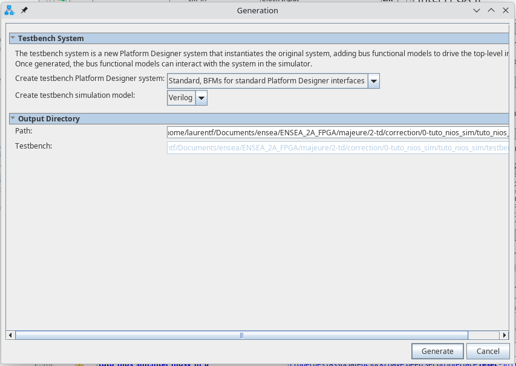

### Création du firmware

1. Dans le dossier du projet, créez un dossier ```soft```. Dans ce dossier, créez un dossier ```app```

2. Dans ce dossier ```app```, créez un fichier ```main.c```, vide pour l'instant.

3. Lancez l'outil ```niosv-shell```. C'est un terminal pas très sympatique.

4. À l'aide de la commande ```cd```, déplacez vous jusqu'à votre dossier de travail (```tuto_nios_sim```).

5. Créez la bsp : 

> niosv-bsp -c -t=hal --sopc-info=tuto_nios_sim.sopcinfo soft/bsp/settings.bsp

6. Créez le projet de l'application :

> niosv-app -a=soft/app/ -b=soft/bsp/ -s=soft/app/main.c --elf-name=main.elf

7. Lancer l'IDE depuis le terminal ```niosv-shell``` :

> RiscFree

8. Une fenêtre vous demande de choisir un _workspace_. Choisissez le dossier ```soft```.

9. Importez la ```bsp```

> File > Import Nios V CMake project...

10. Importez l'```app```

> File > Import Nios V CMake project...


### Hello, world!

1. Ouvrez le fichier ```main.c``` et ajoutez-y ce code simple :

```C
#include <stdio.h>

#include "system.h"
#include "altera_avalon_pio_regs.h"

int main() {
    for (int i = 0; i < 10; ++i)
    {
        printf("Hello world, this is the Nios V/m cpu checking in %d...\n", i);
        IOWR_ALTERA_AVALON_PIO_DATA(PIO_0_BASE, i);
    }

    printf("Bye world\n");
    IOWR_ALTERA_AVALON_PIO_DATA(PIO_0_BASE, 0xFF);

    return 0;
}
```

2. Compilez le projet

3. Dans le terminal ```niosv-shell```, entrez la commande suivante :

> elf2hex soft/app/build/Default/main.elf -b 0x0 -w 32 -e 0x1ffff tuto_nios_sim/testbench/mentor/main.hex

### Simulation

1. Lancez Modelsim, naviguez (avec ```cd```) jusqu'au dossier ```tuto_nios_sim/testbench/mentor/```.

2. Dans l'invite de commande de ```Modelsim```, lancez les trois commandes suivantes :

> do msim_setup.tcl

> ld_debug

(dure ~30 secondes)

> run 4ms 

(1er résultat en 1minute, total en ~2minutes)

3. En cas de modification du code C, recompilez dans ```RiscFree```, puis ré-entrez la commande suivante (dans ```niosv-shell```) : 

> elf2hex soft/app/build/Default/main.elf -b 0x0 -w 32 -e 0x1ffff tuto_nios_sim/testbench/mentor/main.hex

Puis dans modelsim :

> restart -f

> run 4ms

## Séance 1 : Périphériques et Bus

### PIO simple en mode sortie

1. Ouvrez ```Quartus```, puis ```Platform Designer```

> Tools > Platform Designer

2. Sauvegardez. Nommez le fichier ```pio_sim.qsys```

3. Supprimer ```clk_0```

4. Ajoutez un module PIO

> Processors and Peripherals > Peripherals > PIO (Parallel I/O) Intel FPGA IP

5. Exportez tous les signaux

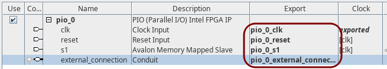

6. Cliquez sur ```Generate HDL```. Choisissez ```VHDL``` dans ```Synthesis``` et ```Simulation```. Puis cliquez sur ```Generate```.

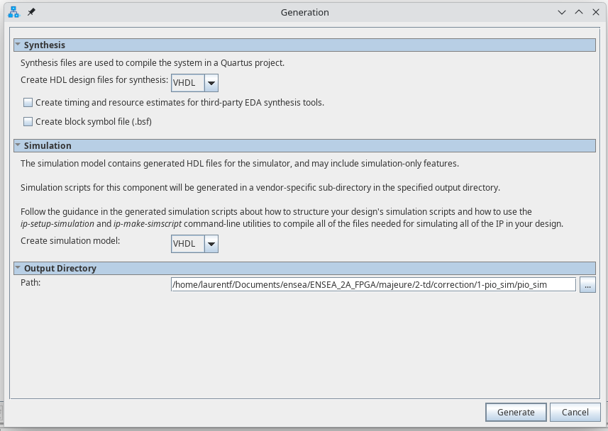

7. Cliquez sur ```Generate > Generate Testbench System```. Choisissez ```Simple, BFMs for clocks and resets``` et ```VHDL```, puis cliquez sur ```Generate```.

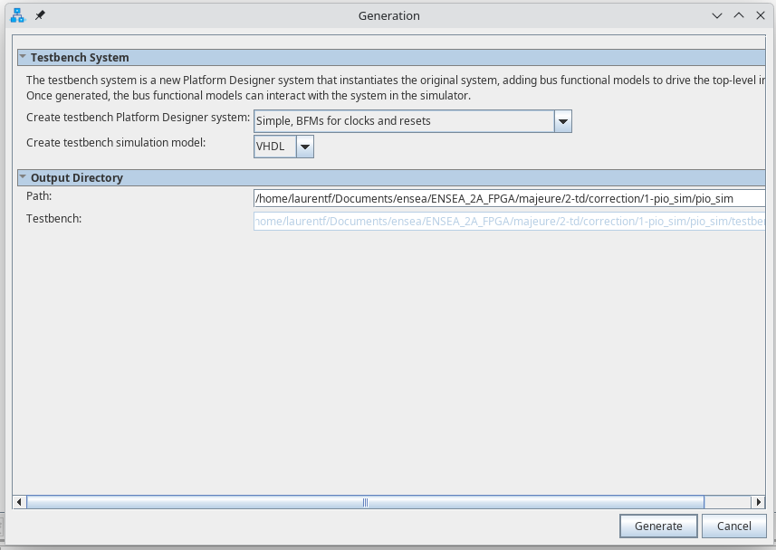

8. Lancez Modelsim. À l'aide de l'invite de commande, naviguez jusqu'à votre dossier de travail, puis jusqu'au dossier ```pio_sim/testbench/mentor```

9. Lancez les deux commandes suivantes :

> do msim_setup.tcl

> ld

10. Ajoutez manuellement les signaux contenus dans ```pio_sim_tb/pio_sim_inst```

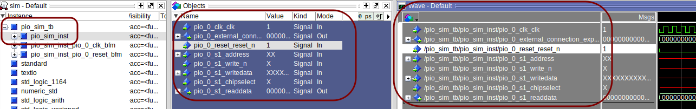

11. Simulez sur une durée de 2 micro secondes :

> run 2us

12. Analysez les signaux : 
    1. Quels sont ceux générés par le testbench ? 
    2. Quels sont les signaux de sortie de composant ? 
    3. Quels signaux ne sont pas générés par le testbench mais devraient l'être ?
    4. Au bout de combien de temps le signal _reset_ passe-t-il à 1 ?

13. Ouvrir le fichier ```pio_sim_tb.vhd``` dans le dossier ```pio_sim/testbench/pio_sim_tb/simulation/```

14. Créez les signaux manquants, connectez les au composant simulé, et initialisez-les à zéro dans un process. 

> N'oubliez pas d'ajouter l'instruction ```wait``` à la fin de votre process.

15. Testez dans modelsim : ```com```, puis ```restart -f```, et enfin ```run 2us```.

16. Que doivent valoir les signaux ```pio_0_s1_write_n``` et ```pio_0_s1_chipselect``` pour réaliser une écriture ? Une lecture ?

17. Combien y a-t-il de registres dans ce composant ? 
    1. Quels sont leur rôles ? Voir la documentation : [ug-683130-852098.pdf](ug-683130-852098.pdf)
    2. Sont ils tous pertinents dans cet exemple ?

18. Écrivez le code permettant d'envoyer les valeurs ```x"12345678"``` puis ```x"90ABCDEF"``` sur le PIO, puis faites une lecture.

### PIO en mode entrée/sortie et interruptions

1. Fermez ```Modelsim```.

2. Dans ```Platform Designer``` sauvegardez (```File > Save as```) dans un autre dossier. Nommez-le ```pio_sim_irq.qsys```.

3. Modifiez le PIO selon la figures suivante :

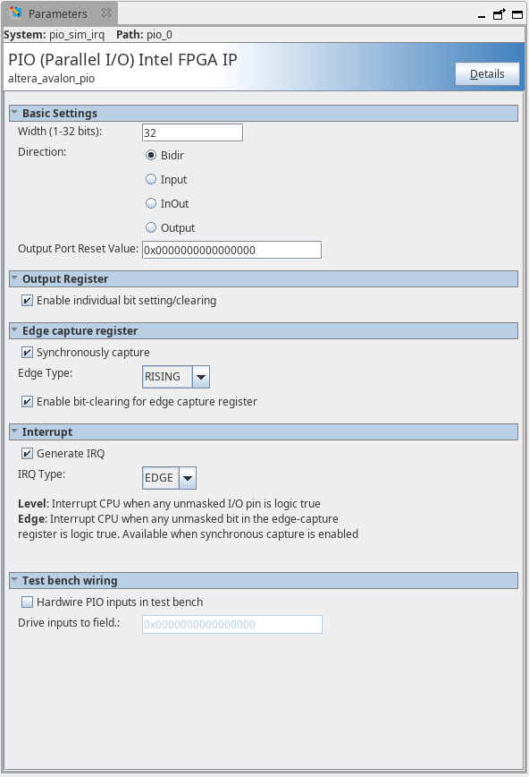

4. Exportez le signal ```irq```.

5. Générez le HDL et le Testbench

6. Modifiez le testbench de telle manière à ce que :
    1. Les 16 bits de poids faible soient des sorties. Testez le mode _individual bit setting/clearing_.
    2. Les 8 bits suivants soient des entrées permettant de générer des interruptions. Testez. 
    3. Les 8 bits de poids fort soient des entrées ne générant pas d'interruption. Testez également.
    4. Les 3 points ci-dessus doivent fonctionner en parallèle.

## Séance 2 : Créer un périphérique

> Écrire, simuler et intégrer à platform designer un générateur de PWM

Dans ce TD, vous allez concevoir votre propre périphérique, un générateur de PWM dont on pourra configurer la fréquence et le rapport cyclique.

Ce type de composants est assez simple, vous aurez besoin d'un compteur et d'un comparateur. Si la valeur du compteur est inférieure à la valeur du rapport cyclique, la sortie vaut '1', sinon '0'.

La partie plus compliquée de ce TD consiste à exposer les registres permettant de paramétrer le composant.
Ces registres seront au nombre de 4 :
* ```CONFIG``` contient un bit ```ENABLE``` permettant de démarrer ou non le compteur.
* ```COUNTER``` contient la valeur du compteur. Elle peut être écrite, et évolue lorsque ```ENABLE``` est à '1'.
* ```MAX``` est la valeur maximale du compteur. Quand cette valeur est atteinte par ```COUNTER```, le compteur repars à zéro.
* ```DUTY``` contient la valeur de seuil, le rapport cyclique.

Dans un premier temps vous travaillerez uniquement en VHDL, avec VSCode (ou autre) et ```Modelsim```, et sans ```Plateform Designer```.

1. Créez un dossier ```avalon_pwm```. Dans ce dossier créez deux sous-dossiers ```rtl``` et ```sim```. Dans le dossier ```rtl```, créez un fichier ```avalon_pwm.vhd``` et son testbench ```avalon_pwm_tb.vhd```
2. En vous basant sur votre analyse du ```PIO``` dans le TD précédent, définissez la liste des signaux nécessaires.
3. Tracez le schéma du circuit permettant de stocker les valeurs dans les quatre registres, et de les restituer en sortie.
4. Écrivez le code correspondant.
5. Écrivez le testbench permettant de tester ces écritures et reléctures.
6. Dans le dossier ```sim```, écrivez le fichier ```.do``` permettant de simuler votre composant, puis simulez-le.
7. Tracez le schéma du circuit permettant de générer la PWM.
8. Ajoutez ce code à votre composant.
9. Simulez-le.

## Séance 3 : Simuler le processeur

### Démarrage

1. Téléchargez le ficher suivant : [nios_td3.zip](nios_td3.zip). Dézippez-le.
    1. L'un des fichiers contient en dur le chemin de l'installation de Quartus (ne faites jamais ça!)
    2. Votre installation de Quartus n'est probablement pas au même endroit que la mienne, il faudra donc la mettre à jour.
    3. Ouvrez le fichier nios_td3/testbench/mentor/msim_setup.tcl
    4. À la ligne 116 : ```set QUARTUS_INSTALL_DIR "/opt/intelFPGA/24.1/quartus/"```
    5. Remplacez ```"/opt/intelFPGA/24.1/quartus/"``` par le chemin d'installation de Quartus sur votre ordi.
    6. Sous Windows, c'est probablement quelque chose du type ```"C:/intelFPGA_lite/24.1std/quartus"```

2. Lancez l'outil ```niosv-shell```. C'est un terminal pas très sympatique.
3. Dans cet outil peu commode, déplacez-vous (à l'aide de la commande ```cd```) jusqu'au dossier ```nios_td3```.
lancez la commande RiscFree.
4. Une fenêtre apparaît pour vous demander de choisir un dossier pour votre _Workspace_. Choisissez le dossier ```soft``` dans le dossier ```nios_td3``` fraichement dézippé.
5. Importez la ```bsp```

> File > Import Nios V CMake project...

Choissez le dossier ```bsp``` dans le dossier ```soft```

6. Importez l'```app```

> File > Import Nios V CMake project...

Choissez le dossier ```app``` dans le dossier ```soft```

7. Ouvrez le fichier ```main.c``` dans ```app```. Écrivez un simple _Hello, World_. Compilez.

8. Dans la console ```niosv-shell```, tappez la commande suivante :

> elf2hex soft/app/build/Default/main.elf -b 0x0 -w 32 -e 0x1ffff nios_td3/testbench/mentor/main.hex

9. Ouvrez ```Modelsim```. Vous aurez besoin durant tout ce TP de jongler entre trois logiciels : 
* RiscFree,
* La console ```niosv-shell```,
* Modelsim.

Restez concentré !

10. Dans ```Modelsim```, naviguez jusqu'à votre dossier de travail (```nios_td3```). Ensuite, entrez la commande suivante :

> cd nios_td3/testbench/mentor

Il devrait y avoir deux fichiers : ```main.hex``` et ```msim_setup.tcl```.

11. Exécutez les 3 commandes suivantes

> do msim_setup.tcl

> ld_debug

Vous pourrez ajouter quelques signaux à observer.

> run 2ms

### Mesurer le temps de démarrage du CPU

Il est difficile de mesurer ce temps à l'aide d'un simple ```printf```.
Vous allez plutôt utiliser le périphérique ```pio``` pour passer un bit à 1.

1. Dans le fichier ```main.c```, incluez les fichiers ```"system.h"``` et ```"altera_avalon_pio_regs.h"```.

2. Dans le fichier ```"altera_avalon_pio_regs.h"```, quelle macro peut-on utiliser pour modifier la valeur de sortie de ```pio_0``` ?

3. Le paramètre ```base``` représente l'adresse du périphérique ```pio_0```. Cette information est disponible dans le fichier ```"system.h"```. Quelle est-elle ?

4. Écrivez le programme permettant de mettre à 1 la sortie de ```pio_0```.

5. Compilez.

6. Depuis la console ```niosv-shell```, regénérez le fichier ```main.hex``` :

> elf2hex soft/app/build/Default/main.elf -b 0x0 -w 32 -e 0x1ffff nios_td3/testbench/mentor/main.hex

7. Dans ```Modelsim```, affichez les signaux d'entrée/sortie de ```nios_td3_inst```. 
    1. Affichez également les signaux de ```pio_0```. 
    2. Affichez également les signaux dont le nom commence par ```data_manager``` du composant ```intel_niosv_m_0```.
    3. Pensez à organiser les signaux avec des séparateurs. 
    4. Configurez le _radix_ des vecteurs en hexadécimal.
    
8. Relancez la simulation

> com

> restart -f

> run 2ms

9. Analysez les signaux
    1. Combien de temps mets le processeur à démarrer ?
    2. Repérez à quel moment ```pio_0``` reçoit des données en provenence du processeur. Comparez ces signaux au signaux du TD1.
    3. Quel composant réalise le décodage d'adresse ?

### Mesurer le temps que prends un printf

De manière analogue à la partie précédente, ici vous mesurerez le temps que prend un ```printf```.

### Mesurer le temps de passage en interruption

1. Pour faire fonctionner le timer, vous aurez besoin d'inclure les deux fichiers suivants :

```C
#include "altera_avalon_timer_regs.h"
#include "sys/alt_irq.h"
```

2. Vous aurez aussi besoin de définir un serveur d'interruption

```C
void timer_isr(void* context)
{
    // Efface le flag d'interruption (écriture de 0)
    IOWR_ALTERA_AVALON_TIMER_STATUS(TIMER_0_BASE, 0);

    IOWR_ALTERA_AVALON_PIO_DATA(PIO_0_BASE, 0);
}
```

3. Et d'enregistrer ce serveur auprès du contrôleur d'interruption

```C
alt_ic_isr_register(TIMER_0_IRQ_INTERRUPT_CONTROLLER_ID, TIMER_0_IRQ, timer_isr, NULL, NULL);
```

4. Enfin, il vous faudra configurer le timer

```C
IOWR_ALTERA_AVALON_TIMER_CONTROL(TIMER_0_BASE, 0x0);
IOWR_ALTERA_AVALON_TIMER_PERIODL(TIMER_0_BASE, 5000);
IOWR_ALTERA_AVALON_TIMER_PERIODH(TIMER_0_BASE, 0);
IOWR_ALTERA_AVALON_TIMER_STATUS(TIMER_0_BASE, 0);
IOWR_ALTERA_AVALON_TIMER_CONTROL(TIMER_0_BASE,
    ALTERA_AVALON_TIMER_CONTROL_ITO_MSK |
    ALTERA_AVALON_TIMER_CONTROL_CONT_MSK |
    ALTERA_AVALON_TIMER_CONTROL_START_MSK
);
```

5. Quel est le rôle de chacune des lignes ci-dessus ? Voir la documentation : [ug-683130-852098.pdf](ug-683130-852098.pdf)

6. Pour tester le fonctionnement du timer, vous pouvez ajouter les lignes suivantes à la fin du main :

```C
for (int i = 2 ; ; i++) 
{
    IOWR_ALTERA_AVALON_PIO_DATA(PIO_0_BASE, i);
}
```

7. Compilez, générez ```main.hex```, visualisez les signaux du timer, simulez.

8. Analysez les signaux
    1. Vérifiez la période du timer.
    2. Retrouvez le registre du compteur. Dans quel sens compte-t-il ?
    3. Combien de temps s'écoule entre la requette d'interruption et sa prise en compte par le système ?
    4. Est-ce que cette durée est répétable ?
    5. Est-ce que le timer s'arrête de compter pendant que l'interruption est en attente ?

9. Pourquoi est-ce une mauvaise idée de mettre un printf dans l'interruption ?

10. Tracez un schéma d'architecture du SOPC.