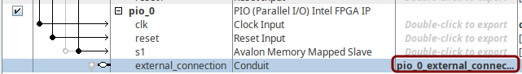
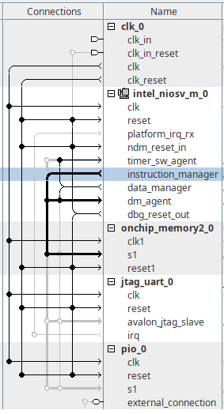
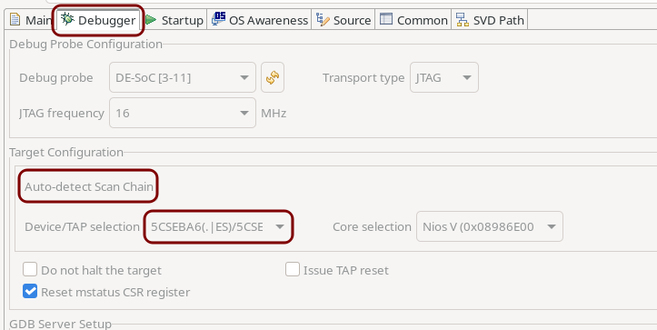
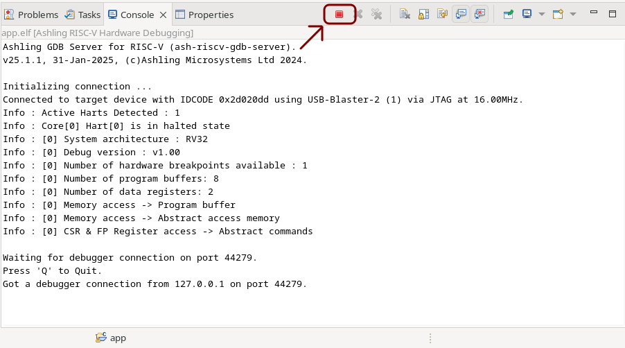
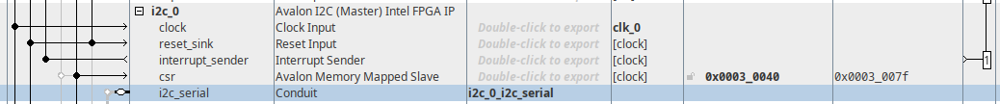

# TP FPGA Avancé

## Tutoriel Nios V

### Organisation

Un projet utilisant un soft-processeur peut vite devenir très complexe. Il est important de conserver une hierarchie claire.

1. Créez un dossier pour ce TP (eg. ```tp_nios_v```).

2. Dans ce dossier, créez les sous-dossiers suivants :
    * ```rtl``` : Contiens les codes VHDL et Verilog,
    * ```synt``` : Le projet Quartus pour la synthèse,
    * ```sim``` : Les fichiers de simulation Modelsim,
    * ```sopc``` : La configuration du soft-processeur,
    * ```soft``` : Le code C exécuté par le soft-processeur.

### Création du projet

1. Dans le dossier ```synt```, créez deux fichiers :
    * ```tp_nios_v.qpf```
    * ```tp_nios_v.qsf```

2. Dans le fichier ```tp_nios_v.qpf```, ajoutez les deux lignes suivantes :
```tcl
QUARTUS_VERSION = "24.1"
PROJECT_REVISION = "tp_nios_v"
```

3. Dans le fichier ```tp_nios_v.qsf```, ajoutez les lignes suivantes :

```tcl
set_global_assignment -name FAMILY "Cyclone V"
set_global_assignment -name DEVICE 5CSEBA6U23I7
set_global_assignment -name TOP_LEVEL_ENTITY "tp_nios_v"
set_global_assignment -name PROJECT_OUTPUT_DIRECTORY output_files
set_instance_assignment -name PARTITION_HIERARCHY root_partition -to | -section_id Top

set_global_assignment -name VHDL_FILE ../rtl/tp_nios_v.vhd
```

4. Dans le dossier ```rtl```, créez un fichier ```tp_nios_v.vhd```

```vhdl
library ieee;
use ieee.std_logic_1164.all;

entity tp_nios_v is
    port (
        i_clk : in std_logic;
        i_rst_n : in std_logic;

        o_led : out std_logic_vector(9 downto 0)
    );
end entity tp_nios_v;

architecture rtl of tp_nios_v is
    
begin
    
end architecture rtl;
```

5. Vous pouvez déjà ajouter les contraintes directement dans le fichier ```tp_nios_v.qsf``` :

```tcl
set_location_assignment PIN_V11 -to i_clk
set_location_assignment PIN_AH17 -to i_rst_n
set_location_assignment PIN_AG28 -to o_led[0]
set_location_assignment PIN_AE25 -to o_led[1]
set_location_assignment PIN_AG26 -to o_led[2]
set_location_assignment PIN_AG25 -to o_led[3]
set_location_assignment PIN_AG23 -to o_led[4]
set_location_assignment PIN_AH21 -to o_led[5]
set_location_assignment PIN_AF22 -to o_led[6]
set_location_assignment PIN_AG20 -to o_led[7]
set_location_assignment PIN_AG18 -to o_led[8]
set_location_assignment PIN_AG15 -to o_led[9]

set_instance_assignment -name IO_STANDARD "3.3-V LVTTL" -to i_clk
set_instance_assignment -name IO_STANDARD "3.3-V LVTTL" -to i_rst_n
set_instance_assignment -name IO_STANDARD "3.3-V LVTTL" -to o_led[0]
set_instance_assignment -name IO_STANDARD "3.3-V LVTTL" -to o_led[1]
set_instance_assignment -name IO_STANDARD "3.3-V LVTTL" -to o_led[2]
set_instance_assignment -name IO_STANDARD "3.3-V LVTTL" -to o_led[3]
set_instance_assignment -name IO_STANDARD "3.3-V LVTTL" -to o_led[4]
set_instance_assignment -name IO_STANDARD "3.3-V LVTTL" -to o_led[5]
set_instance_assignment -name IO_STANDARD "3.3-V LVTTL" -to o_led[6]
set_instance_assignment -name IO_STANDARD "3.3-V LVTTL" -to o_led[7]
set_instance_assignment -name IO_STANDARD "3.3-V LVTTL" -to o_led[8]
set_instance_assignment -name IO_STANDARD "3.3-V LVTTL" -to o_led[9]
```

6. Ouvrez le projet (```tp_nios_v.qpf```) dans Quartus.

### Création du SOPC

1. Lancez ```Platform Designer```

> Tools > Platform Designer

Cet outil vous permet de construire votre propre micro-contrôleur (wouhou !)

2. Sauvegardez dans le dossier ```sopc```. Appelez le ```nios.qsys```

3. La clock est déjà présente, ajoutez le processeur

> Processors and Peripherals > Embedded Processors > Nios V/m Microcontroller Intel FPGA IP

4. Dans les options du processeur, activez l'option ```Enable Reset from Debug Module```

5. Ajoutez une mémoire _On-Chip_. Configurez ```Total memory size``` à ```131072```

> Basic Functions > On Chip Memory > On-Chip Memory (RAM or ROM) Intel FPGA IP

6. Ajoutez le module jtag uart.

> Interface Protocols > JTAG UART Intel FPGA IP

7. Ajoutez un PIO. Configurez ```Width``` à ```10```

> Processors and Peripherals > Peripherals > PIO (Parallel I/O) Intel FPGA IP

8. Exportez ```external_connection```



9. Connectez l'horloge à tous les composants comme sur la figures suivante :


10. Connectez le signal ```clk_reset``` et ```dbg_reset_out``` selon la figure suivante :


11. Connectez le signal ```instruction_manager``` du processeur au signal ```s1``` de la mémoire :



12. Connectez le signal ```data_manager``` aux autres composants :


13. Générez les adresses.

> System > Assign Base Addresses

14. Configurez le vecteur de reset :

> Double-cliquez sur le processeur ```intel_niosv_m_0```
> Dans la section ```Traps, Exceptions and Interrupts```, configurez ```Reset Agent``` sur ```on_chip_memory2_0.s1```


15. Sauvegardez.

16. Générez le code HDL et fermez Platform Designer.

> Cliquez sur Generate HDL. Choisissez VHDL au lieu de Verilog. Laisser le reste des paramètres par défault.

### De retour dans Quartus

1. Ajoutez le fichier ```sopc/nios/synthesis/nios.qip``` au projet, comme proposé par le logiciel.

2. Ouvrez le fichier ```tp_nios_v.vhd```, avant la déclaration de l'```entity```, ajoutez les deux lignes suivantes :

```vhdl
library nios;
use nios.nios;
```

3. Instanciez le soft-processeur :

```vhdl
nios0 : entity nios.nios
    port map (
        clk_clk                          => i_clk,
        reset_reset_n                    => i_rst_n,
        pio_0_external_connection_export => o_led
    );
```

> Les noms des signaux peuvent être copié-collés depuis le fichier ```sopc/nios/nios_inst.vhd```

4. Compilez le projet, programmez la carte, comme d'habitude. Si vous ne trouver pas le fichier pour flasher votre FPGA, il est possible qu'il manque des fichiers de licence, veuillez suivre [le tutoriel](https://github.com/lfiack/ENSEA_2A_FPGA_Public/blob/main/majeure/3-tp/get_licence.md) pour créer et importer votre licence.

### Création du projet soft

1. Dans le dossier ```soft```, créez un dossier ```app```

2. Dans ce dossier ```app```, créez un fichier ```main.c```

3. Lancez l'outil ```niosv-shell```. C'est un terminal pas très sympatique.

4. À l'aide de la commande ```cd```, déplacez vous jusqu'à votre dossier de travail (```tp_nios_v```).

5. Créez la bsp : 

> niosv-bsp -c -t=hal --sopc-info=sopc/nios.sopcinfo soft/bsp/settings.bsp

6. Créez le projet de l'application :

> niosv-app -a=soft/app/ -b=soft/bsp/ -s=soft/app/main.c

7. Lancer l'IDE depuis le terminal ```niosv-shell```:

> RiscFree

8. Une fenêtre vous demande de choisir un _workspace_. Choisissez le dossier ```soft```.

9. Importez la ```bsp```

> File > Import Nios V CMake project...

10. Importez l'```app```

> File > Import Nios V CMake project...

### Hello, world!

1. Ouvrez le fichier ```main.c``` et ajoutez-y ce code simple :

```C
#include <stdio.h>

int main (void)
{
	printf("Hello, world!\n");

	return 0;
}
```

2. Compilez le projet

3. Lancez le programme :

> Run > Run 

Choisissez

> Ashling RISC-V Hardware Debugging

Puis

> app.elf

Dans l'onglet ```Debugger```

> Cliquez sur Auto-detect Scan Chain

Puis choisissez 

> 5CSEBA6



Enfin, cliquez sur ```Run```.

4. Le soft-processeur est maintenant programmé. Déconnectez le debugger (cf. image ci-dessous)



5. Dans le terminal, connectez vous au soft-processeur 

> juart-terminal

Vous devriez voir apparaître le contenu de votre printf !

### L'inévitable chenillard

Eh oui, vous croyiez que vous pourriez y échapper ? Eh bien non.

Les macros permettant d'accéder au PIO sont disponibles dans le fichier suivant :

> ```bsp/drivers/inc/altera_avalon_pio_regs.h```

La macro qui nous intéresse est la suivante :

> ```IOWR_ALTERA_AVALON_PIO_DATA(base, data)```

où ```base``` est l'adresse du PIO telle que définie dans le soft-processeur.

L'adresse, quant à elle, est définie dans ```bsp/system.h``` sous le nom ```PIO_0_BASE```.

Enfin, vous aurez besoin d'un délai, utilisez ```usleep(useconds_t usec)```.

N'oubliez pas les includes :
```C
#include <unistd.h> // for usleep

#include "system.h"
#include "altera_avalon_pio_regs.h"
```

1. Écrivez un chenillard.

## Petit projet

Dans un vrai écran magique, on n'efface pas l'écran en appuyant sur un bouton, mais en retournant l'écran.
La carte utilisée en TP dispose d'un accéléromètre. Vous allez l'utiliser comme signal pour effacer l'écran.

L'accéléromètre utilisé est l'ADXL345 d'Analog Device dont la documentation est disponible ici : [adxl345.pdf](https://www.analog.com/media/en/technical-documentation/data-sheets/adxl345.pdf).

### Le niveau à bulles

Vous allez commencer par quelque chose de plus simple. Quand on a un marteau, tous les problèmes ressemblent à des clous. 
Et quand on a un accéléromètre et des LED, on fait un niveau à bulle. Ça peut être pratique pour monter une étagère.

Pour cette partie, vous pouvez simplement partir du TP chenillard. 
L'objectif de ce projet est d'afficher l'angle de la carte sur les LED à la manière d'un niveau à bulles.

Les étapes suivantes sont la pour vous aider à vous organiser. Pensez à consulter l'[Annexe](#annexe), en particulier les parties concernant le [Contrôleur I2C](#contrôleur-i2c) et l'[Accéléromètre ADXL345](#accéléromètre-adxl345).

1. Éditez le soft-processeur pour ajouter un contrôleur I2C.
2. Modifiez le VHDL en conséquent.
3. Supprimer le dossier ```bsp``` ainsi que tous les fichiers (sauf ```main.c```) dans le dossier ```app```.
4. Recréez la bsp et l'app, importez-les dans RiscFree.
    * Le chenillard devrait toujours être fonctionnel !
5. Écrivez le code permettant de représenter l'angle de la carte sur les LED à la manière d'un niveau à bulles.

### Le retour de l'écran magique

1. Intégrez le projet de l'écran magique de mineure à votre projet.
2. Ajoutez un PIO à votre soft-processeur. Il servira comme signal d'effacement de l'écran magique.
3. N'oubliez pas de supprimer et de recréer la bsp et l'app.
4. Écrivez le code permettant d'effacer l'écran lorsque la carte est retournée, comme sur un vrai écran magique.

# Annexe

## Contrôleur I2C

Dans ```Platform Designer``` : 

> Interface Protocols > Serial > Avalon I2C (Master) Intel FPGA IP



Dans le ```vhdl``` :

```vhdl
nios0 : entity nios.nios
    port map (
        -- ...
        i2c_0_i2c_serial_sda_in => s_i2c_sda_in,
        i2c_0_i2c_serial_scl_in => s_i2c_scl_in,
        i2c_0_i2c_serial_sda_oe => s_i2c_sda_oe,
        i2c_0_i2c_serial_scl_oe => s_i2c_scl_oe
    );
    
s_i2c_scl_in <= io_i2c_scl;
io_i2c_scl <= '0' when s_i2c_scl_oe = '1' else 'Z';

s_i2c_sda_in <= io_i2c_sda;
io_i2c_sda <= '0' when s_i2c_sda_oe = '1' else 'Z';
```

Dans le programme ```C``` :

```C
#include "altera_avalon_i2c.h"
```

Pour des exemples de code : [Embedded Peripherals IP User Guide](ug-683130-852098.pdf)
Ou ici : [fpga-i2c-host-core](https://www.intel.com/content/www/us/en/docs/programmable/683130/25-1/fpga-i2c-host-core.html)

Liste des fonctions utiles :
```C
ALT_AVALON_I2C_DEV_t* alt_avalon_i2c_open(const char* name);
```
```C
void alt_avalon_i2c_master_target_set(ALT_AVALON_I2C_DEV_t * i2c_dev, alt_u32 target_addr);
```
```C
ALT_AVALON_I2C_STATUS_CODE alt_avalon_i2c_master_tx_rx(ALT_AVALON_I2C_DEV_t *i2c_dev,
                                       const alt_u8 * txbuffer,
                                       const alt_u32 txsize,
                                       alt_u8 * rxbuffer,
                                       const alt_u32 rxsize,
                                       const alt_u8 use_interrupts);
```
```C
ALT_AVALON_I2C_STATUS_CODE alt_avalon_i2c_master_tx(ALT_AVALON_I2C_DEV_t *i2c_dev,
                                       const alt_u8 * buffer,
                                       const alt_u32 size,
                                       const alt_u8 use_interrupts);
```

## Accéléromètre ADXL345

1. Pour tester la connexion I2C, vous pouvez lire le registre ```DEVID``` (adresse ```0x00```).
    * La valeur de retour devrait toujours être ```0xE5```
2. Pour démarrer l'accéléromètre, il suffit d'écrire '1' dans le bit ```Measure``` du registre ```POWER_CTL``` dont l'adresse est ```0x2D```.
3. Vous pouvez ensuite lire les 6 registres de ```DATAX0``` à ```DATAZ1``` en une seule lecture.
```C
uint8_t rxbuffer[6];
...
alt_avalon_i2c_master_tx_rx(i2c_dev, txbuffer, 1, rxbuffer, 6, ALT_AVALON_I2C_NO_INTERRUPTS);
```
4. La mise en forme des résultats peut être un peu _tricky_, ce n'est pas l'objectif aujourd'hui, voici le code :
```C
int16_t x, y, z;
x = (rxbuffer[1] << 8) + rxbuffer[0];
y = (rxbuffer[3] << 8) + rxbuffer[2];
z = (rxbuffer[5] << 8) + rxbuffer[4];
```

## Contraintes carte TELECRAN

J2 correspond à GPIO0
J1 correspond à GPIO1

### LEDs
| Nom  | GPIO  | FPGA |
| :--- |:-----:| ----:|
| LED0 | J1:5  | AG28 |
| LED1 | J1:7  | AE25 |
| LED2 | J1:9  | AG26 |
| LED3 | J1:13 | AG25 |
| LED4 | J1:17 | AG23 |
| LED5 | J1:21 | AH21 |
| LED6 | J1:25 | AF22 |
| LED7 | J1:27 | AG20 |
| LED8 | J1:33 | AG18 |
| LED9 | J1:37 | AG15 |

### Encodeurs
| Nom      | GPIO  | FPGA |
| :------- |:-----:| ----:|
| LEFT_PB  | J1:10 | AH27 |
| LEFT_A   | J1:8  | AF27 |
| LEFT_B   | J1:6  | AF28 |
| RIGHT_PB | J2:40 | AA11 |
| RIGHT_A  | J2:38 | AA26 |
| RIGHT_B  | J2:39 | AA13 |

### ADXL345
| Nom  | GPIO  | FPGA |
| :--- |:-----:| ----:|
| INT1 | J2:33 | Y18  |
| INT2 | J2:34 | Y17  |
| nCS  | J2:32 | W14  |
| SCL  | J2:37 | Y11  |
| SDA  | J2:36 | AB26 |
| SDO  | J2:35 | AB25 |
