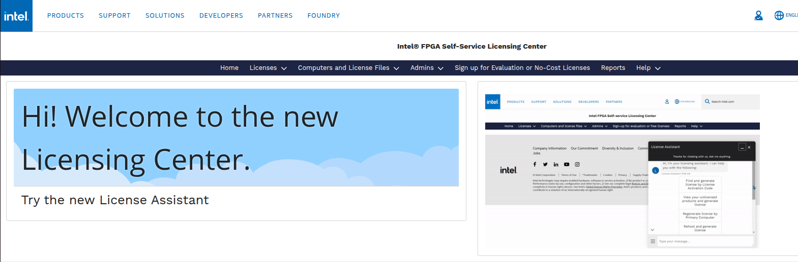
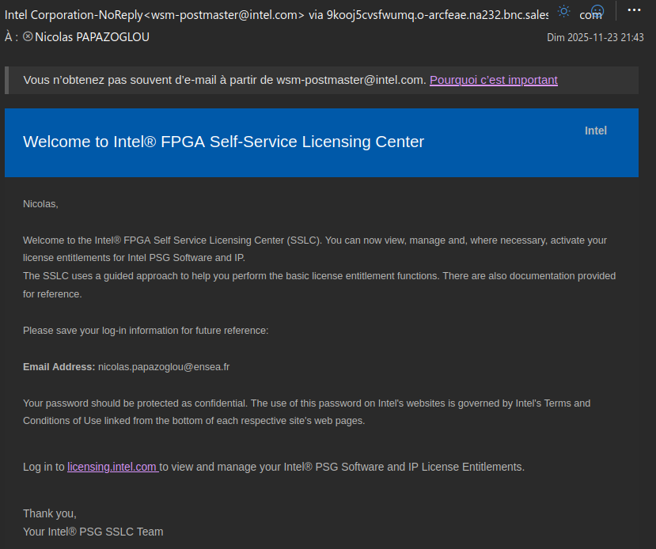
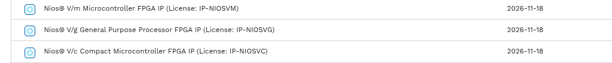
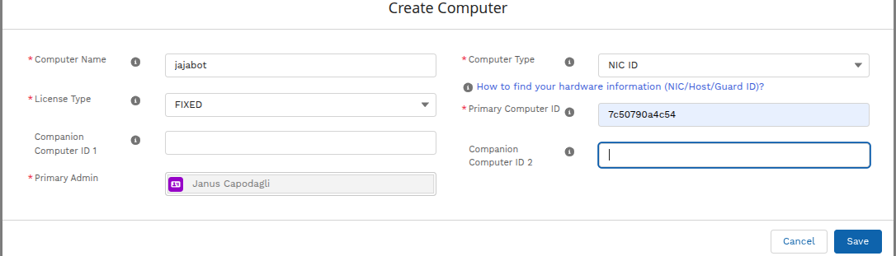
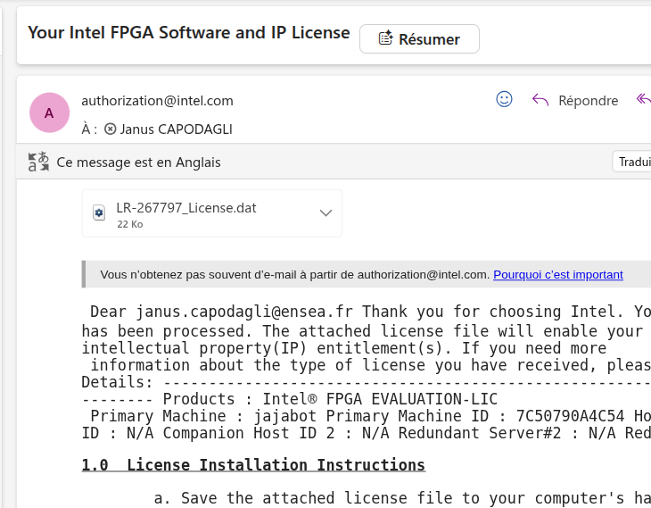
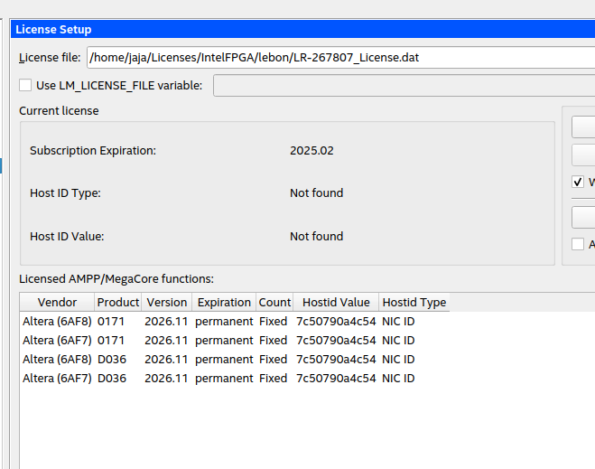

## How to get Licence for Nios V
1. Aller dans sur [le site](https://licensing.intel.com/psg/s/ ) d'Intel pour créer votre licence 


2. Créer un compte sur le site d'Intel avec le mail de l'école.

3. Une fois le compte créer, attendre quelques minutes que vous soyez bien enregistrer dans le système de gestion de licence d'Intel, vous devriez recevoir un mail à cet effet.


4. Se connecter, on est censé tomber sur cette page : 
    * Aller dans "Sign up for Evaluation or No-Cost Licenses"
    * Choisir la bonne licence de nios ```Nios V/m Microcontroller FPGA IP```
    

    * Dans la nouvelle page, choisir "create computer" et créer le nouveau ordi : 
        * pour le Primary Computer ID, il faut mettre celui renseigné dans ```Quartus > Tools > License Setup``` (adresse mac du PC), il est trouvable tout en bas de la page de la rubrique ```Local system info```
    

    * Valider la demande, vous recevrez le fichier de licence par mail
    

5. Télécharger la licence sur l'ordinateur puis l'importer dans quartus.  


6. Redémarrer quartus
7. Vous pouvez à présenter programmer la carte avec votre Nios V